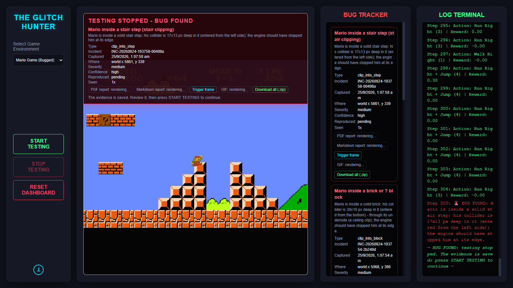
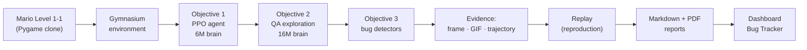
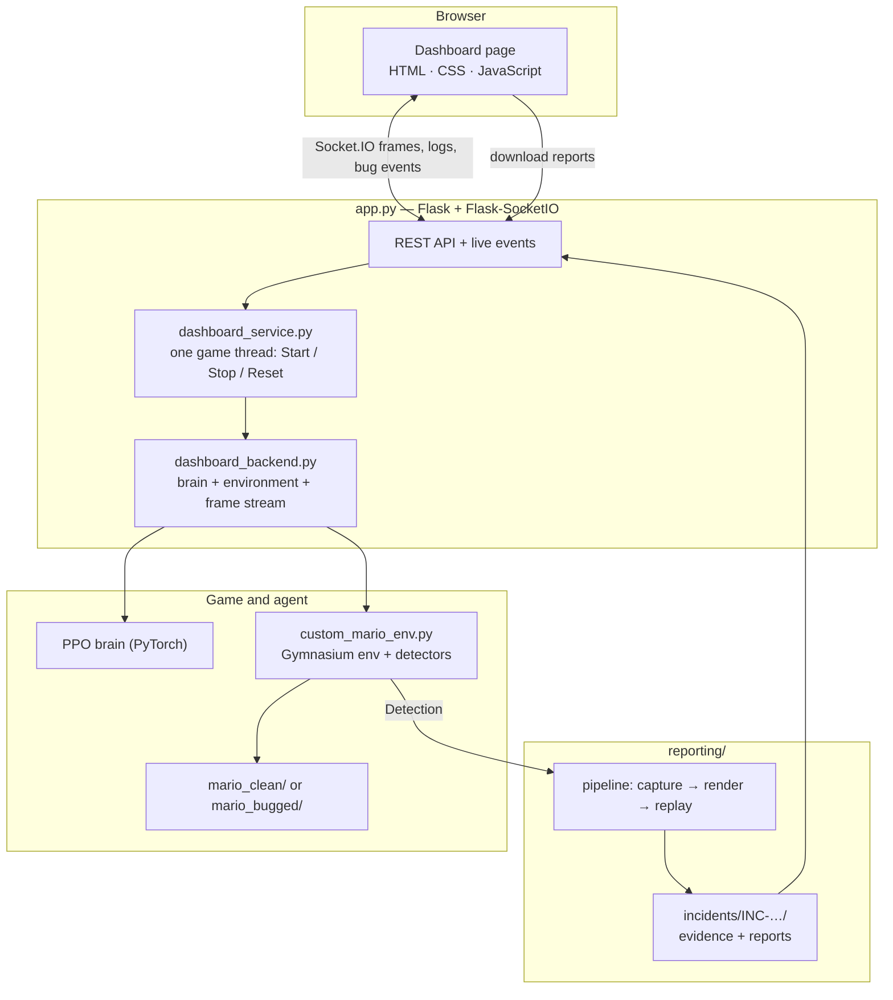
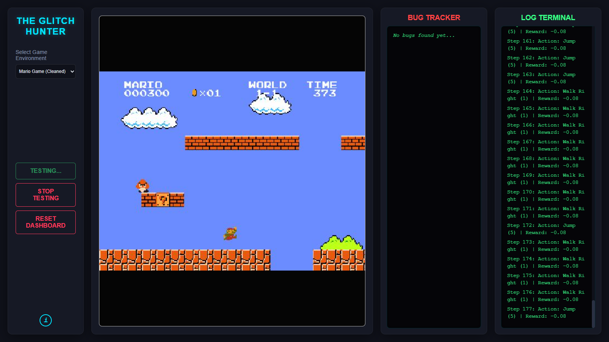
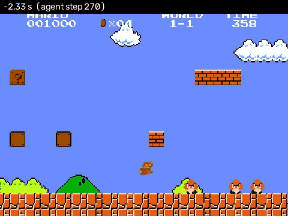

<!-- Section 1. Project Title + Short Tagline -->
<h1 align="center">Glitch Hunter</h1>

<p align="center">
  <b>An AI agent that plays Super Mario Bros Level 1-1, hunts for game bugs on its own,<br>
  and turns every bug it finds into a reproducible, fully documented report.</b>
</p>

<p align="center">
  <a href="https://github.com/TanmaySingh2711/glitch_hunter_project/actions/workflows/ci.yml"></a>
  
  
  
</p>

<p align="center">
  
</p>

---

## 2. Project Overview

Testing a game by hand is slow: a person has to play the same level again and
again, looking for the rare moment where something goes wrong. **Glitch
Hunter automates that job.**

- A **reinforcement-learning agent** (PPO) learned to play Level 1-1 of a
  Super Mario Bros clone and then to **explore** it like a QA tester: every
  ledge, gap and corner it can physically reach.
- While it plays, **detectors** check that the game obeys its own rules.
  Mario must never pass into a solid block, be stopped by something that
  isn't drawn, get hurt by an enemy he never touched, or jump higher than
  physics allows.
- When a rule breaks, testing **pauses**, the exact moment is **saved as
  evidence** (screenshot, GIF, trajectory), the episode is **replayed** to
  prove the bug reproduces, and a **Markdown and PDF report** is written.
- Everything is shown live in a **browser dashboard**.

The result is an end-to-end, autonomous game-QA loop: *play → detect → capture → reproduce → report.*

---

## 3. Objectives

| Objective | Goal | Outcome |
|---|---|---|
| **1 — Autonomous exploration agent** | Train an agent that plays and finishes Level 1-1 by itself | The **6M brain**: 6,000,000 training steps, finishes the level in 46.8% of episodes |
| **2 — QA / glitch-hunting agent** | Turn it into a QA explorer that covers the reachable level *without* losing the ability to finish it | The **16M QA brain**: 84.25% of the reachable space covered, level completion raised to 56.6% |
| **3 — Automated bug reporting** | Detect bugs automatically and turn each one into reproducible, reviewable evidence | A complete incident pipeline + dashboard; all **6 injected benchmark bugs** detected, reproduced and reported with **0 false alarms** on the clean game |

---

## 4. Complete Project Flow



**Objective 1:** Game → RL setup → PPO training → **6M autonomous brain**<br>
**Objective 2:** 6M brain → QA coverage, rewards and anomaly checks → training, audits and recovery → **16M final QA brain**<br>
**Objective 3:** 16M QA brain → automated detection, evidence and reporting → benchmark bugs detected → **autonomous QA reporting system**

---

## 5. Objective 1 Summary

**Start.** The Mario clone was wrapped as a Gymnasium environment with 10
discrete actions (walk, run, jump and their combinations). The agent sees 4
stacked 84×84 grayscale frames and acts every 4 engine frames. A PPO agent
with a convolutional policy (`CnnPolicy`) was trained with 8 parallel game
workers.

**Work.** A completion reward (new ground covered, progress milestones, the
flag), checkpoint/resume support and the first version of the live dashboard.

**End.** After **6,000,000 steps** the agent finishes Level 1-1 in **46.8%**
of episodes (234/500, mean progress 0.71). This brain,
`mario_brain_checkpoint.zip`, became both the **starting point** and the
**baseline** for Objective 2: every later brain must keep at least this
ability to finish the level. It ships inside the repository and is the
dashboard's fallback when the final brain is not installed.

---

## 6. Objective 2 Summary

**Start.** Training resumed from the 6M brain with a new goal: explore the
level like a QA tester.

**What was added.**

| System | What it does |
|---|---|
| Spatial coverage | A 1-pixel map of everywhere Mario has been, shared by all workers and kept across episodes |
| Testable mask | Which pixels Mario can physically reach: **3,757,990** of them. This is the coverage denominator |
| QA reward + lifecycle | Pays for newly covered reachable space; each episode moves from EXPLORE to COMPLETE only on evidence, never on a timer |
| Anchor consolidation | After every update, keeps the policy close to a frozen healthy brain so it does not forget how to finish the level |
| Retention test | A fixed 500-episode protocol that labels every checkpoint HEALTHY, WARNING or REGRESSED |

**Training, audits and recovery.** Hard audits found and fixed reward
farming, a wrong coverage denominator, and a collapse of the finishing skill
around 6.4M steps. That collapse was recovered from the last healthy
checkpoint. Resume safety, telemetry and anomaly classification were
tightened along the way.

**End.** Training stopped at **16,000,000 steps** with:

- **84.25%** of the reachable space covered (3,166,235 / 3,757,990 pixels, an
  accepted practical stopping point, not 100%);
- **56.6%** level completion (283/500, mean progress 0.75), up from 46.8%;
- verdict **HEALTHY**.

This brain, `glitch_hunter_main_brain.zip`, was frozen with its coverage
state and hashes, and Objective 2 was closed. **It is the final brain of the
project**, distributed as a GitHub Release asset (see
[Installation, Step 4](#step-4--install-the-final-16m-qa-brain)).

---

## 7. Objective 3 Summary

Objective 3 uses the frozen 16M QA brain, read-only, as the tester and builds
the bug-reporting system around it.

**Detect.** After every engine frame, detectors check the game against rules
that must hold everywhere in the level:

- Mario alive below the floor or far above the level;
- impossible speed;
- score or coin count going backwards;
- Mario inside a solid step, pipe, ground or block;
- Mario stopped by something that isn't drawn;
- an enemy hit with no contact;
- a jump faster or higher than the engine's fastest real jump.

**Preserve.** At the exact frame a detector fires, the pipeline saves the
full-resolution screenshot, the recent trajectory, the whole action log and
the game state. The dashboard stops before the game moves on.

**Report.** In the background it renders a context GIF, a Markdown report and
a PDF report. It also **replays the episode** in a separate process to check
that the bug happens again on the same frame.

**Review.** The dashboard shows each incident with its type, place, severity,
confidence, reproduction result and download links. Repeat sightings of the
same bug are counted on the same incident.

---

## 8. Injected Benchmark Bugs

To prove the system works, six bugs were **deliberately injected into
`mario_bugged/` only**. Each is declared in
[`mario_bugged/INJECTED_BUGS.json`](mario_bugged/INJECTED_BUGS.json).

| # | Bug | What goes wrong | Detected as |
|---|---|---|---|
| 1 | Stair clipping | The top blocks of the first staircase's two tall columns have no collision, so Mario sinks into them | `clip_into_step` |
| 2 | Pipe clipping | Only the left rim of the fourth pipe is solid, so Mario falls into it | `clip_into_pipe` |
| 3 | Ceiling clipping | A lone brick does not stop Mario while he moves up; he jumps straight through it | `clip_into_block` |
| 4 | Invisible wall | An undrawn collider on open ground blocks Mario; he can stand on thin air | `invisible_collision` |
| 5 | False Goomba hit | One Goomba hurts Mario from about 30 px away, before they touch | `hit_without_contact` |
| 6 | Abnormal sky jump | A jump from one open-sky stretch launches Mario far above the screen | `impossible_jump` (and `above_world`) |

The detectors are **generic**. None of them knows where a bug was injected;
each checks its rule everywhere, against the level as it is **drawn**.

| | Clean game (`mario_clean/`) | Bugged game (`mario_bugged/`) |
|---|---|---|
| Injected benchmark bugs | none, ever | the six above |
| Validation result | **0 reports** across 101 brain episodes and dashboard runs | every bug detected, **reproduced**, reported |

**Natural bugs are a separate category.** The original clone has quirks of
its own. For example, Objective 2 documented an acceleration state that leaks
from the ground into a jump. Such quirks exist in **both** variants and are
not part of the benchmark. The detectors are tuned so that ordinary clean-game
play never raises a report.

---

## 9. System Architecture



| Layer | Role |
|---|---|
| **Dashboard** (`app.py`, `dashboard_service.py`, `dashboard_backend.py`, `templates/`, `static/`) | Serves the page, streams the game, pauses on bugs, serves evidence safely |
| **Environment + agent** (`custom_mario_env.py`, `agent_logic.py`, `rewards/`) | Runs the game one frame at a time, applies the brain's actions, runs the detectors |
| **Exploration** (`exploration/`) | Coverage map, reachability mask, episode lifecycle, all tuned constants |
| **Evaluation** (`evaluation/`) | The 500-episode completion-retention protocol |
| **Reporting** (`reporting/`) | Detectors, incident store, GIF/Markdown/PDF rendering, replay, game-variant identity |
| **Training** (`train_agent.py`, `training/`) | PPO training, safe resume, callbacks (Objectives 1–2) |

More detail: [docs/ARCHITECTURE.md](docs/ARCHITECTURE.md).

---

## 10. Tech Stack

| Purpose | Technology |
|---|---|
| Language | **Python 3.12** |
| Game engine | **Pygame 2.6.1** (the Mario clone) |
| RL environment | **Gymnasium 1.3.0** |
| Reinforcement learning | **Stable-Baselines3 2.9.0** (PPO, `CnnPolicy`) on **PyTorch 2.5.1** (CUDA 12.1 build) |
| Numerics and data | **NumPy 2.5.2**, cloudpickle 3.1.2, JSON / JSON Lines, SHA-256 manifests |
| Image and video | **OpenCV 5.0** (frame stream, PNG evidence), **Pillow 12.3** (GIFs) |
| Reports | **fpdf2 2.8.8** (PDF), Markdown |
| Web dashboard | **Flask 3.1.3**, **Flask-SocketIO 5.6.1**, HTML/CSS/vanilla JavaScript, Socket.IO client (bundled locally) |
| Packaging | **uv** (`uv.lock`) or pip (`requirements.txt`) |
| Quality | pytest 9.1.1, pytest-cov 7.1.0, Ruff 0.16.6, mypy 2.3.1 (strict), pre-commit 4.6.2 |
| CI | GitHub Actions (Ubuntu + Windows) |
| Optional | TensorBoard (training curves only) |

---

## 11. Project Structure

```text
glitch_hunter_project/
├── app.py                    # Start here: the dashboard server (python app.py)
├── run_dashboard.bat         # Windows: double-click to start the dashboard
├── dashboard_service.py      # the single game thread (Start / Stop / Reset / pause on bug)
├── dashboard_backend.py      # loads the brain, runs the game, streams frames, captures incidents
├── custom_mario_env.py       # the game as a Gymnasium environment + built-in detectors
├── agent_logic.py            # reward wrapper
├── game_window.py            # game-window placement (Windows APIs)
├── train_agent.py            # training (Objectives 1-2; not needed to use the dashboard)
│
├── mario_clean/              # the original game - trusted, unmodified baseline
├── mario_bugged/             # copy with the 6 declared benchmark bugs (+ INJECTED_BUGS.json, VARIANT.md)
│
├── reporting/                # Objective 3: detectors, incident pipeline, store, reports, replay
├── exploration/              # coverage, reachability mask, lifecycle, config.py (every tuned value)
├── evaluation/               # 500-episode completion protocol + frozen 6M baseline
├── rewards/                  # completion reward (Objective 1) and QA reward (Objective 2)
├── training/                 # training callbacks and checkpoint helpers
├── common/                   # logging, atomic file writes, tool start-up
├── tools/                    # command-line tools (see tools/README.md)
├── templates/, static/       # the dashboard page (Socket.IO client bundled for offline use)
├── tests/                    # automated tests
├── docs/                     # Objective 1-3 summaries, architecture, performance
├── assets/                   # README images
│
├── mario_brain_checkpoint.zip   # the 6M brain (Objective 1): the fallback, shipped in git
├── artifacts.json               # SHA-256 of every protected artifact, incl. the final brain's files
├── pyproject.toml, uv.lock      # dependencies (uv)
└── requirements.txt             # dependencies (pip)
```

Not in git: the final 16M brain's four files (installed in Step 4 of
Installation, into the project root, `checkpoints_qa/` and
`exploration_data/`) and `incidents/`, which the dashboard creates for
evidence.

---

## 12. Installation

### Prerequisites

| Requirement | Notes |
|---|---|
| **Git** | to clone the repository |
| **Python 3.12** exactly | not 3.11, not 3.13 (`requires-python = "==3.12.*"`). Get it from [python.org](https://www.python.org/downloads/) |
| **OS** | **Windows 10/11** is the primary, fully verified platform. Linux is tested in CI (headless). macOS is untested |
| **GPU** | **not required** to run the dashboard; an NVIDIA GPU only speeds up training |
| **Disk** | about 5 GB for the environment (PyTorch with CUDA is the largest part; the CPU-only build is much smaller) |

### Step 1 — Clone the repository

```bash
git clone https://github.com/TanmaySingh2711/glitch_hunter_project.git
cd glitch_hunter_project
```

### Step 2 — Create and activate a virtual environment

The project's scripts expect the environment to be called **`venv_gpu`**.

Windows (PowerShell or Command Prompt):

```powershell
py -3.12 -m venv venv_gpu
venv_gpu\Scripts\activate
```

Linux / macOS:

```bash
python3.12 -m venv venv_gpu
source venv_gpu/bin/activate
```

> On PowerShell, if activation is blocked by the execution policy, run
> `Set-ExecutionPolicy -Scope CurrentUser RemoteSigned` once, or use Command Prompt.

### Step 3 — Install the dependencies

**Option A — uv (recommended on Windows and Linux).** One command, exact
versions from `uv.lock`, including the CUDA 12.1 build of PyTorch (it also
runs on machines without an NVIDIA GPU):

```bash
python -m pip install uv
uv sync --active
```

> `--active` matters: it installs into the activated `venv_gpu`. Without it,
> uv creates a separate `.venv` folder that the commands below do not use.

**Option B — pip (three steps, in this exact order).** Use this on macOS, or
if you want the smaller CPU-only PyTorch:

```bash
# 1. PyTorch first - pick ONE line
pip install torch==2.5.1 --index-url https://download.pytorch.org/whl/cu121   # NVIDIA GPU
pip install torch==2.5.1                                                      # CPU only / macOS

# 2. Stable-Baselines3 without its dependencies
pip install stable-baselines3==2.9.0 --no-deps

# 3. Everything else
pip install -r requirements.txt
```

> **Why this order?** PyTorch is pinned to 2.5.1, the newest build for CUDA
> 12.1. Stable-Baselines3 asks for a newer torch, so installing it normally
> would silently swap your PyTorch for a different build. `--no-deps` (or uv's
> override in `pyproject.toml`) prevents that. Do **not** install `eventlet`:
> the dashboard is designed to run without it.

**Linux only:** OpenCV needs the system OpenGL library:

```bash
sudo apt-get install -y libgl1
```

### Step 4 — Install the final 16M QA brain

The project's final brain (Objective 2, 16,000,000 steps) is published as a
**GitHub Release asset** rather than stored in git: four files, about 23 MB
zipped. One command downloads it, checks every file against the SHA-256
hashes tracked in `artifacts.json`, and puts each file where the dashboard
expects it:

```bash
python tools/final_brain.py install
```

If the download is blocked, get `glitch_hunter_final_brain_16M.zip` from the
repository's **Releases** page (release `v1.0.0`) and install from the file:

```bash
python tools/final_brain.py install --zip path/to/glitch_hunter_final_brain_16M.zip
```

It installs `glitch_hunter_main_brain.zip`,
`glitch_hunter_main_brain_coverage.npz`,
`checkpoints_qa/final_objective2_16000000/FINAL_OBJECTIVE2.json` and
`exploration_data/reachable_mask.npz`, read-only. It refuses a bundle whose
hashes do not match, and it never overwrites a different file.

| Brain | Where it comes from | When the dashboard uses it |
|---|---|---|
| **Final 16M QA brain** (`glitch_hunter_main_brain.zip`) | this step | whenever it is installed and its hash matches the closure record |
| 6M brain (`mario_brain_checkpoint.zip`) | inside the repository | fallback only, when the final brain is not installed |

Skipping this step still gives a working dashboard, including bug detection
and reports, but it plays the Objective-1 brain, not the final project.

### Step 5 — Check the installation

```bash
python app.py --help
```

It should print the dashboard's options. No configuration file or
environment variable is required. When the dashboard starts (next section),
its terminal names the brain it loaded:
`[DASHBOARD] glitch_hunter_main_brain.zip (qa_exploration)` for the final
brain, or `mario_brain_checkpoint.zip (legacy_completion)` for the fallback.

---

## 13. How to Run

### Start the dashboard

**Windows, one click:** open the project folder in **File Explorer** and
double-click **`run_dashboard.bat`**. A terminal window opens, and your
browser opens **http://localhost:5000** after about 12 seconds.

> Double-clicking the file inside VS Code only opens it in the editor. From
> VS Code's terminal, run `.\run_dashboard.bat` instead.

**Any platform, from a terminal:**

```bash
# from the project folder, with venv_gpu activated
python app.py                      # starts on the clean game
python app.py --game mario_bugged  # starts on the bugged game
```

Then open **http://localhost:5000**.

### Test the game

1. **Choose the game** in *Select Game Environment*: **Mario Game (Cleaned)**
   or **Mario Game (Bugged)**. Switching resets the dashboard and loads that
   game.
2. Click **START TESTING**. A game window opens and the same view streams to
   the browser. The Log Terminal shows every action the agent takes.
3. **When a bug is detected, testing stops.** A red *Testing Stopped – Bug
   Found* banner appears over the video with the bug's details, and the bug
   is added to the **Bug Tracker**.
4. Open the evidence from the banner or the Bug Tracker: **PDF report**,
   **Markdown report**, **Trigger frame**, **GIF**, or **Download all (.zip)**.
   Reports that are still rendering show as *rendering…* and fill in by
   themselves.
5. Click **START TESTING** again to resume from the same moment.

On the clean game the Bug Tracker should stay at *No bugs found yet…*: that is
the expected, healthy result. On the bugged game with the 16M brain, the agent
runs into all six benchmark bugs within its first episode.

### Where the evidence is saved

Every incident gets its own folder, `incidents/INC-<date>-<time>-<id>/`:

| File | Contents |
|---|---|
| `trigger.png` | the exact frame the bug was detected (full resolution) |
| `context.gif` | the moments leading up to it |
| `report.md`, `report.pdf` | the bug reports |
| `incident.json` | the full record: detector, measurements, location, game and brain identity |
| `trajectory.json`, `context_frames.zip` | per-frame state and frames before the trigger |
| `reproduction.json` | the replay result |
| `manifest.json` | SHA-256 of every file |

Evidence is never deleted or overwritten. **Reset Dashboard** only clears the
Bug Tracker's view of the current session.

```bash
python tools/incidents.py list            # every saved incident, newest first
python tools/incidents.py show <INC-id>   # one incident's summary and files
python tools/incidents.py verify          # re-check every file against its hash
```

### Stop the dashboard

Press **Ctrl + C** in its terminal, or close that window. If port 5000 is
still busy (Windows PowerShell):

```powershell
Get-NetTCPConnection -LocalPort 5000 -State Listen | ForEach-Object { Stop-Process -Id $_.OwningProcess -Force }
```

### Options

| Option | Purpose |
|---|---|
| `--game mario_clean` / `--game mario_bugged` | the game to start on (default: clean) |
| `--incidents-dir PATH` | save evidence somewhere other than `incidents/` |
| `--no-reproduce` | skip the replay step (faster; reports are still written) |
| `--synthetic-probe X` | pipeline testing only: raise a clearly labelled *fake* bug at world x ≥ X |
| `GLITCH_HUNTER_PORT` (env var) | use a port other than 5000 |
| `GLITCH_HUNTER_HOST=0.0.0.0` (env var) | allow other devices on your network to open the dashboard. It has no password, so only do this on a trusted network |

`run_dashboard.bat` passes options through, e.g. `run_dashboard.bat --game mario_bugged`.

### Developer commands

```bash
python tools/check.py                         # lint, types, tests, artifact hashes (a few minutes)
python tools/check.py --full                  # + slow tests and the 90% coverage floor (~30 min)
python tools/validate_incident_pipeline.py    # 36-check end-to-end test of the reporting pipeline (~30 s)
python train_agent.py --dry-run-resume        # shows what a training run would load; trains nothing
```

Training is **not** needed to use the project, and it takes many hours. A real
QA training launch is refused unless it is given an explicit cap
(`--safety-cap-timesteps N`) or `--unrestricted`. See [tools/README.md](tools/README.md) for every tool.

---

## 14. Clean vs Bugged Game

The repository contains **two copies of the same game**:

| | `mario_clean/` | `mario_bugged/` |
|---|---|---|
| Purpose | the **trusted baseline**: every brain was trained and measured on it | the **test target** for bug detection |
| Content | the original game, unmodified | the same game + the 6 declared benchmark bugs |
| Protected by | a pinned SHA-256 of its whole game tree: any edit fails the test suite | every difference must be declared in `INJECTED_BUGS.json`, marked in the code with `INJECTED BUG <id>`, and match a pinned diff hash |
| Select it with | *Mario Game (Cleaned)* or `--game mario_clean` (default) | *Mario Game (Bugged)* or `--game mario_bugged` |

**Why intentional bugs never go into the clean game.** The clean game is the
reference that proves a report is real. A detector that fires on the clean
game is a false alarm; one that fires on the bugged game at a declared bug is
a real detection. If the clean game were changed, that comparison would no
longer mean anything, and the brains' measured results would no longer match
the game they were trained on.

Every incident records which game produced it (variant name and game-tree
hash), so a report can never be attributed to the wrong game. Details:
[mario_bugged/VARIANT.md](mario_bugged/VARIANT.md).

---

## 15. Dashboard Features

| Feature | What you can do |
|---|---|
| **Live game view** | Watch the agent play, streamed to the browser while the game window runs alongside |
| **Select Game Environment** | Switch between *Mario Game (Cleaned)* and *Mario Game (Bugged)* |
| **START TESTING / Stop Testing** | Start or pause; Start always resumes from the same moment |
| **Reset Dashboard** | End the session, close the game window, clear the log and the Bug Tracker (saved evidence stays) |
| **Pause on every bug** | *Testing Stopped – Bug Found* banner with the bug's type, incident id, time, world position, severity, confidence, reproduction status and times seen |
| **Bug Tracker** | Every bug found in this session, newest first; a repeat raises its *Seen* count instead of adding a duplicate |
| **Evidence links** | PDF report, Markdown report, trigger frame, GIF, and the whole evidence bundle as a `.zip` |
| **Log Terminal** | Every action the agent takes and its reward; detected bugs appear in red |
| **Game window** | Closing it with its X just pauses testing; START TESTING reopens it |
| **Agent actions (i)** | The list of the agent's 10 actions |
| **Offline** | Works with no internet connection |

---

## 16. Screenshots / GIFs

**The dashboard while testing the clean game.** The Bug Tracker stays empty, as it should:

<p align="center"></p>

**Testing stopped on a detected bug** (stair clipping on the bugged game), with the evidence links and the Bug Tracker:

<p align="center"></p>

**The context GIF the pipeline saved for that bug.** Mario lands and sinks into the stair column, and the last frame is the exact trigger frame:

<p align="center"></p>

These are real captures from this project (the GIF is trimmed to its final
seconds). Visuals not yet included: a page of a generated PDF report.

---

## 17. Documentation Links

| Document | What it covers |
|---|---|
| [docs/OBJECTIVE1.md](docs/OBJECTIVE1.md) | Objective 1: the 6M brain, how it was trained, its results |
| [docs/OBJECTIVE2.md](docs/OBJECTIVE2.md) | Objective 2: QA exploration, audits and recovery, the final 16M brain and why training stopped |
| [docs/OBJECTIVE3.md](docs/OBJECTIVE3.md) | Objective 3: the reporting pipeline, detectors, benchmark bugs and validation |
| [docs/ARCHITECTURE.md](docs/ARCHITECTURE.md) | Components, invariants, protected artifacts, where to change what |
| [docs/PERFORMANCE.md](docs/PERFORMANCE.md) | Time and memory per worker, and how to measure them |
| [mario_bugged/VARIANT.md](mario_bugged/VARIANT.md) | The six benchmark bugs and how changes to the bugged game are controlled |
| [mario_bugged/INJECTED_BUGS.json](mario_bugged/INJECTED_BUGS.json) | The full declaration of every injected bug |
| [tools/README.md](tools/README.md) | Every command-line tool and what it writes |
| [CONTRIBUTING.md](CONTRIBUTING.md) | Development setup and the quality gate |
| [SECURITY.md](SECURITY.md) | What the dashboard exposes and how it is kept safe |
| [THIRD_PARTY_NOTICES.md](THIRD_PARTY_NOTICES.md) | Terms for the game code and assets |

---

## 18. License

This project's own code is released under the **MIT License**. See [LICENSE](LICENSE).

It covers the Python modules, dashboard, tests, tools, documentation and the
6M model weights (`mario_brain_checkpoint.zip`). It does **not** cover:

| Component | Terms |
|---|---|
| `mario_clean/`, `mario_bugged/` (the Mario clone) | Third-party code by Justin Meister, published **without an open-source license**. The author describes it as intended for **non-commercial educational purposes**. Do not use it commercially |
| Game graphics, music and sounds | **Nintendo** intellectual property (*Super Mario Bros.*), not licensed by this project. This project is not affiliated with or endorsed by Nintendo |
| `static/vendor/socket.io.min.js` | Socket.IO client, under its own MIT license |

Full details: [THIRD_PARTY_NOTICES.md](THIRD_PARTY_NOTICES.md).

---

## 19. Acknowledgements

- **Justin Meister** — the original [Mario-Level-1](https://github.com/justinmeister/Mario-Level-1)
  Python/Pygame clone this project is built on.
- **Nintendo** — creator of *Super Mario Bros.*, whose artwork and audio the clone uses.
- **Stable-Baselines3** and **PyTorch** — the PPO implementation and the deep-learning framework.
- **Gymnasium** — the reinforcement-learning environment API.
- **Pygame** and **SDL** — the game engine.
- **Flask**, **Flask-SocketIO** and **Socket.IO** — the live dashboard.
- **NumPy**, **OpenCV**, **Pillow** and **fpdf2** — numerics, images, GIFs and PDF reports.
- **uv**, **pytest**, **Ruff** and **mypy** — packaging and code quality.
