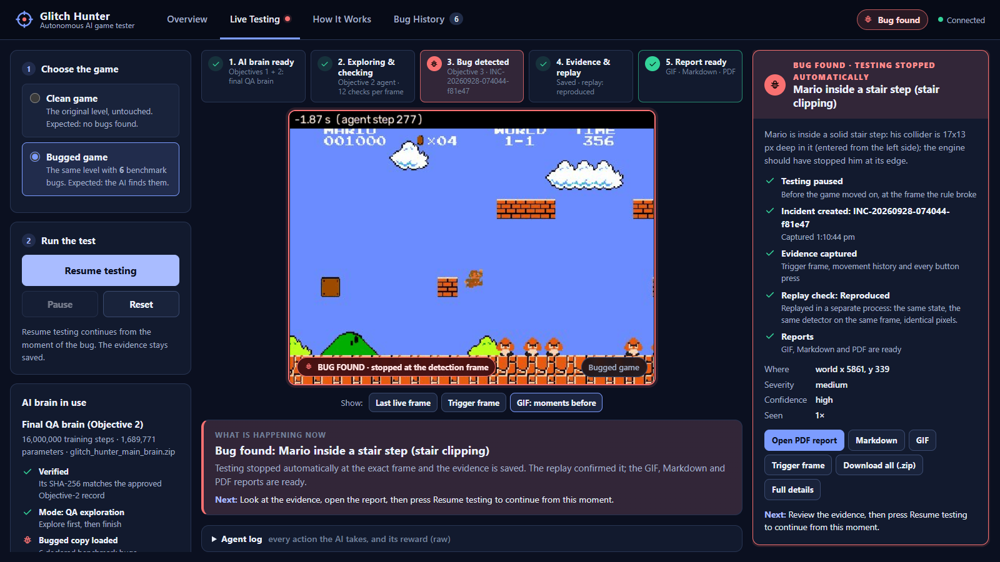
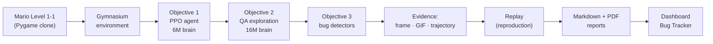
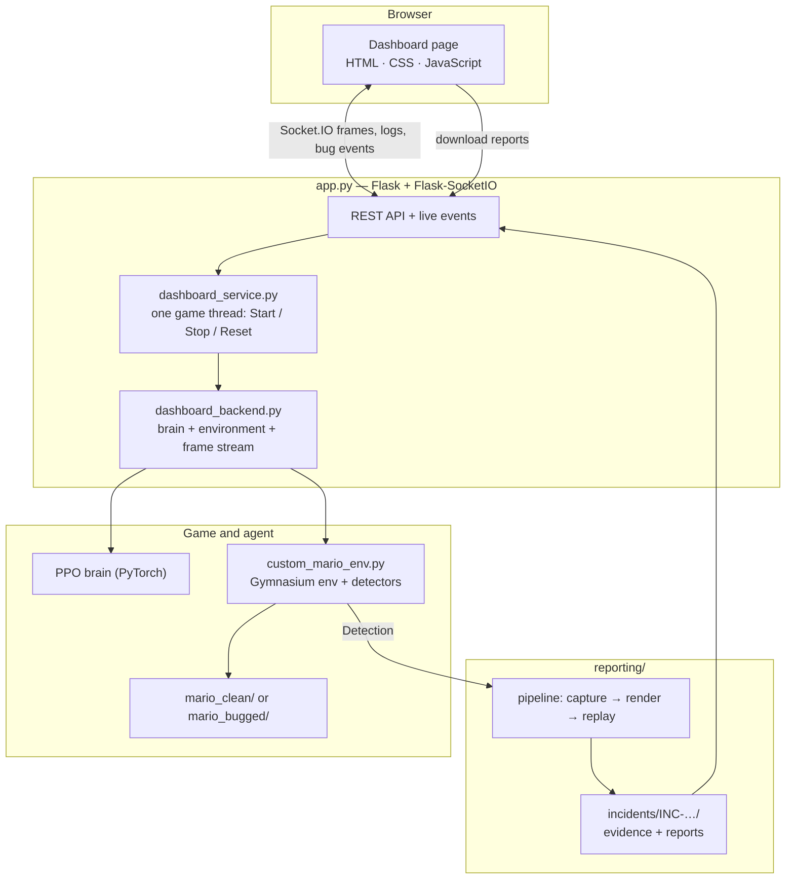
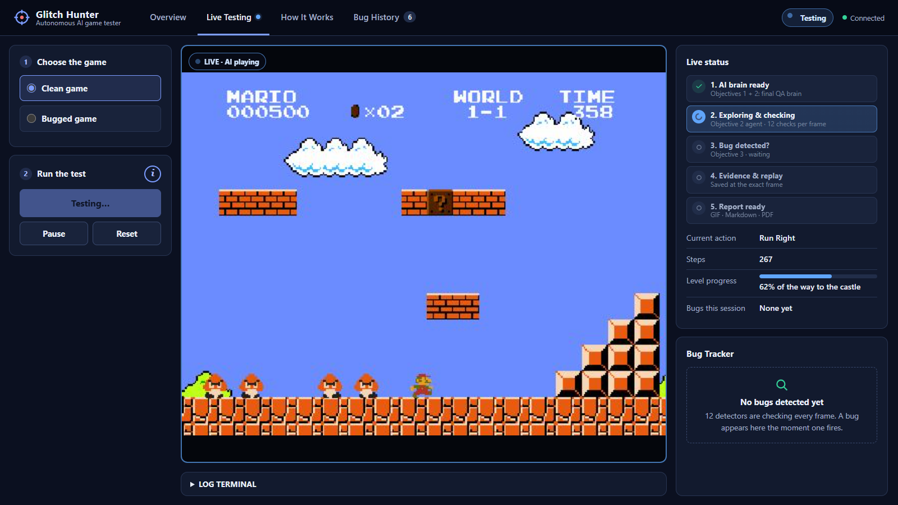
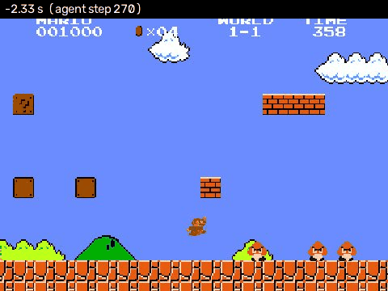

<!-- Section 1. Project Title + Short Tagline -->
<h1 align="center">Glitch Hunter</h1>

<p align="center">
  <b>An AI agent that plays Super Mario Bros Level 1-1, hunts for game bugs on its own,<br>
  and turns every bug it finds into a reproducible, fully documented report.</b>
</p>

<p align="center">
  <a href="https://github.com/TanmaySingh2711/glitch_hunter_project/actions/workflows/ci.yml"></a>
  
  
  
</p>

<p align="center">
  
</p>

---

## 2. Project Overview

Testing a game by hand is slow: a person has to play the same level again and
again, looking for the rare moment where something goes wrong. **Glitch
Hunter automates that job.**

- A **reinforcement-learning agent** (PPO) learned to play Level 1-1 of a
  Super Mario Bros clone and then to **explore** it like a QA tester: every
  ledge, gap and corner it can physically reach.
- While it plays, **detectors** check that the game obeys its own rules.
  Mario must never pass into a solid block, be stopped by something that
  isn't drawn, get hurt by an enemy he never touched, or jump higher than
  physics allows.
- When a rule breaks, testing **pauses**, the exact moment is **saved as
  evidence** (screenshot, GIF, trajectory), the episode is **replayed** to
  prove the bug reproduces, and a **Markdown and PDF report** is written.
- Everything is shown live in a **browser dashboard**.

The result is an end-to-end, autonomous game-QA loop: *play → detect → capture → reproduce → report.*

---

## 3. Objectives

| Objective | Goal | Outcome |
|---|---|---|
| **1 — Autonomous exploration agent** | Train an agent that plays and finishes Level 1-1 by itself | The **6M brain**: 6,000,000 training steps, finishes the level in 46.8% of episodes |
| **2 — QA / glitch-hunting agent** | Turn it into a QA explorer that covers the reachable level *without* losing the ability to finish it | The **16M QA brain**: 84.25% of the reachable space covered, level completion raised to 56.6% |
| **3 — Automated bug reporting** | Detect bugs automatically and turn each one into reproducible, reviewable evidence | A complete incident pipeline + dashboard; all **6 injected benchmark bugs** detected, reproduced and reported with **0 false alarms** on the clean game |

---

## 4. Complete Project Flow


```mermaid
flowchart LR
    A["Mario Level 1-1<br/>(Pygame clone)"] --> B["Gymnasium<br/>environment"]
    B --> C["Objective 1<br/>PPO agent<br/>6M brain"]
    C --> D["Objective 2<br/>QA exploration<br/>16M brain"]
    D --> E["Objective 3<br/>bug detectors"]
    E --> F["Evidence:<br/>frame · GIF · trajectory"]
    F --> G["Replay<br/>(reproduction)"]
    G --> H["Markdown + PDF<br/>reports"]
    H --> I["Dashboard<br/>Bug Tracker"]
```

**Objective 1:** Game → RL setup → PPO training → **6M autonomous brain**<br>
**Objective 2:** 6M brain → QA coverage, rewards and anomaly checks → training, audits and recovery → **16M final QA brain**<br>
**Objective 3:** 16M QA brain → automated detection, evidence and reporting → benchmark bugs detected → **autonomous QA reporting system**

---

## 5. Objective 1 Summary

**Start.** The Mario clone was wrapped as a Gymnasium environment with 10
discrete actions (walk, run, jump and their combinations). The agent sees 4
stacked 84×84 grayscale frames and acts every 4 engine frames. A PPO agent
with a convolutional policy (`CnnPolicy`) was trained with 8 parallel game
workers.

**Work.** A completion reward (new ground covered, progress milestones, the
flag), checkpoint/resume support and the first version of the live dashboard.

**End.** After **6,000,000 steps** the agent finishes Level 1-1 in **46.8%**
of episodes (234/500, mean progress 0.71). This brain,
`mario_brain_checkpoint.zip`, became both the **starting point** and the
**baseline** for Objective 2: every later brain must keep at least this
ability to finish the level. It ships inside the repository and is the
dashboard's fallback when the final brain is not installed.

---

## 6. Objective 2 Summary

**Start.** Training resumed from the 6M brain with a new goal: explore the
level like a QA tester.

**What was added.**

| System | What it does |
|---|---|
| Spatial coverage | A 1-pixel map of everywhere Mario has been, shared by all workers and kept across episodes |
| Testable mask | Which pixels Mario can physically reach: **3,757,990** of them. This is the coverage denominator |
| QA reward + lifecycle | Pays for newly covered reachable space; each episode moves from EXPLORE to COMPLETE only on evidence, never on a timer |
| Anchor consolidation | After every update, keeps the policy close to a frozen healthy brain so it does not forget how to finish the level |
| Retention test | A fixed 500-episode protocol that labels every checkpoint HEALTHY, WARNING or REGRESSED |

**Training, audits and recovery.** Hard audits found and fixed reward
farming, a wrong coverage denominator, and a collapse of the finishing skill
around 6.4M steps. That collapse was recovered from the last healthy
checkpoint. Resume safety, telemetry and anomaly classification were
tightened along the way.

**End.** Training stopped at **16,000,000 steps** with:

- **84.25%** of the reachable space covered (3,166,235 / 3,757,990 pixels, an
  accepted practical stopping point, not 100%);
- **56.6%** level completion (283/500, mean progress 0.75), up from 46.8%;
- verdict **HEALTHY**.

This brain, `glitch_hunter_main_brain.zip`, was frozen with its coverage
state and hashes, and Objective 2 was closed. **It is the final brain of the
project**, and it comes with the repository (see
[Installation, Step 4](#step-4--install-the-final-16m-qa-brain)).

---

## 7. Objective 3 Summary

Objective 3 uses the frozen 16M QA brain, read-only, as the tester and builds
the bug-reporting system around it.

**Detect.** After every engine frame, detectors check the game against rules
that must hold everywhere in the level:

- Mario alive below the floor or far above the level;
- impossible speed;
- score or coin count going backwards;
- Mario inside a solid step, pipe, ground or block;
- Mario stopped by something that isn't drawn;
- an enemy hit with no contact;
- a jump faster or higher than the engine's fastest real jump.

**Preserve.** At the exact frame a detector fires, the pipeline saves the
full-resolution screenshot, the recent trajectory, the whole action log and
the game state. The dashboard stops before the game moves on.

**Report.** In the background it renders a context GIF, a Markdown report and
a PDF report. It also **replays the episode** in a separate process to check
that the bug happens again on the same frame.

**Point to the fix.** Each report has a **Where to fix it** section: the lines
in the game's own code that cause the bug, and the exact edit for each
("Delete lines 554-555", "Change line 115 to: `step4 =
collider.Collider(5874, 366, 40, 176)`"). It is worked out from what the
incident recorded (the drawn level, the colliders in view, the detector's
measurements) and the game's source code, never from the list of injected
bugs, and is labelled as a lead, not a proven cause. It is tested the hard
way: all eleven suggested edits for the six benchmark bugs are applied to a
copy of the bugged game, and every bug's spot then plays exactly like the
clean game (`tests/test_fix_hint.py`).

**Review.** The dashboard shows each incident with its type, place, severity,
confidence, reproduction result and download links. Repeat sightings of the
same bug are counted on the same incident.

---

## 8. Injected Benchmark Bugs

To prove the system works, six bugs were **deliberately injected into
`mario_bugged/` only**. Each is declared in
[`mario_bugged/INJECTED_BUGS.json`](mario_bugged/INJECTED_BUGS.json).

| # | Bug | What goes wrong | Detected as |
|---|---|---|---|
| 1 | Stair clipping | The top blocks of the first staircase's two tall columns have no collision, so Mario sinks into them | `clip_into_step` |
| 2 | Pipe clipping | Only the left rim of the fourth pipe is solid, so Mario falls into it | `clip_into_pipe` |
| 3 | Ceiling clipping | A lone brick does not stop Mario while he moves up; he jumps straight through it | `clip_into_block` |
| 4 | Invisible wall | An undrawn collider on open ground blocks Mario; he can stand on thin air | `invisible_collision` |
| 5 | False Goomba hit | One Goomba hurts Mario from about 30 px away, before they touch | `hit_without_contact` |
| 6 | Abnormal sky jump | A jump from one open-sky stretch launches Mario far above the screen | `impossible_jump` (and `above_world`) |

The detectors are **generic**. None of them knows where a bug was injected;
each checks its rule everywhere, against the level as it is **drawn**.

| | Clean game (`mario_clean/`) | Bugged game (`mario_bugged/`) |
|---|---|---|
| Injected benchmark bugs | none, ever | the six above |
| Validation result | **0 reports** across 101 brain episodes and dashboard runs | every bug detected, **reproduced**, reported |

**Natural bugs are a separate category.** The original clone has quirks of
its own. For example, Objective 2 documented an acceleration state that leaks
from the ground into a jump. Such quirks exist in **both** variants and are
not part of the benchmark. The detectors are tuned so that ordinary clean-game
play never raises a report.

---

## 9. System Architecture


```mermaid
flowchart TD
    subgraph Browser
        UI["Dashboard page<br/>HTML · CSS · JavaScript"]
    end
    subgraph Server["app.py — Flask + Flask-SocketIO"]
        API["REST API + live events"]
        SVC["dashboard_service.py<br/>one game thread: Start / Stop / Reset"]
        BACK["dashboard_backend.py<br/>brain + environment + frame stream"]
    end
    subgraph Game["Game and agent"]
        ENV["custom_mario_env.py<br/>Gymnasium env + detectors"]
        VAR["mario_clean/ or mario_bugged/"]
        BRAIN["PPO brain (PyTorch)"]
    end
    subgraph Reporting["reporting/"]
        PIPE["pipeline: capture → render → replay"]
        STORE["incidents/INC-…/<br/>evidence + reports"]
    end
    UI <-->|Socket.IO frames, logs, bug events| API
    UI -->|download reports| API
    API --> SVC --> BACK
    BACK --> BRAIN
    BACK --> ENV --> VAR
    ENV -->|Detection| PIPE --> STORE
    STORE --> API
```

| Layer | Role |
|---|---|
| **Dashboard** (`app.py`, `dashboard_service.py`, `dashboard_backend.py`, `dashboard_facts.py`, `templates/`, `static/`) | Serves the page, streams the game and what the AI is doing, pauses on bugs, serves evidence safely, shows the project's measured facts |
| **Environment + agent** (`custom_mario_env.py`, `agent_logic.py`, `rewards/`) | Runs the game one frame at a time, applies the brain's actions, runs the detectors |
| **Exploration** (`exploration/`) | Coverage map, reachability mask, episode lifecycle, all tuned constants |
| **Evaluation** (`evaluation/`) | The 500-episode completion-retention protocol |
| **Reporting** (`reporting/`) | Detectors, incident store, GIF/Markdown/PDF rendering, replay, game-variant identity |
| **Training** (`train_agent.py`, `training/`) | PPO training, safe resume, callbacks (Objectives 1–2) |

More detail: [docs/ARCHITECTURE.md](docs/ARCHITECTURE.md).

---

## 10. Tech Stack

| Purpose | Technology |
|---|---|
| Language | **Python 3.12** |
| Game engine | **Pygame 2.6.1** (the Mario clone) |
| RL environment | **Gymnasium 1.3.0** |
| Reinforcement learning | **Stable-Baselines3 2.9.0** (PPO, `CnnPolicy`) on **PyTorch 2.14.0** (CUDA 12.6 build) |
| Numerics and data | **NumPy 2.5.2**, cloudpickle 3.1.2, JSON / JSON Lines, SHA-256 manifests |
| Image and video | **OpenCV 5.0** (frame stream, PNG evidence), **Pillow 12.3** (GIFs) |
| Reports | **fpdf2 2.8.8** (PDF), Markdown |
| Web dashboard | **Flask 3.1.3**, **Flask-SocketIO 5.6.1**, HTML/CSS/vanilla JavaScript, Socket.IO client (bundled locally) |
| Packaging | **uv** (`uv.lock`) or pip (`requirements.txt`) |
| Quality | pytest 9.1.1, pytest-cov 7.1.0, Ruff 0.16.6, mypy 2.3.1 (strict), pre-commit 4.6.2 |
| CI | GitHub Actions (Ubuntu + Windows) |
| Optional | TensorBoard (training curves only) |

---

## 11. Project Structure

```text
glitch_hunter_project/
├── setup.bat, setup.sh       # one-click setup: installs everything, then starts the dashboard
├── app.py                    # Start here: the dashboard server (python app.py)
├── run_dashboard.bat         # Windows: double-click to start the dashboard
├── desktop.py                # run_dashboard.bat's helpers: full speed on battery, centred windows
├── dashboard_service.py      # the single game thread (Start / Stop / Reset / pause on bug)
├── dashboard_backend.py      # loads the brain, runs the game, streams frames, captures incidents
├── dashboard_facts.py        # the Overview page's facts, read from the project's own files
├── custom_mario_env.py       # the game as a Gymnasium environment + built-in detectors
├── agent_logic.py            # reward wrapper
├── game_window.py            # game-window placement (Windows APIs)
├── train_agent.py            # training (Objectives 1-2; not needed to use the dashboard)
│
├── mario_clean/              # the original game - trusted, unmodified baseline
├── mario_bugged/             # copy with the 6 declared benchmark bugs (+ INJECTED_BUGS.json, VARIANT.md)
│
├── reporting/                # Objective 3: detectors, incident pipeline, store, reports, replay, where to fix
├── exploration/              # coverage, reachability mask, lifecycle, config.py (every tuned value)
├── evaluation/               # 500-episode completion protocol + frozen 6M baseline
├── rewards/                  # completion reward (Objective 1) and QA reward (Objective 2)
├── training/                 # training callbacks and checkpoint helpers
├── common/                   # logging, atomic file writes, tool start-up
├── tools/                    # command-line tools (see tools/README.md)
├── templates/, static/       # the dashboard page (Socket.IO client bundled for offline use)
├── tests/                    # automated tests
├── docs/                     # Objective 1-3 summaries, architecture, performance
├── assets/                   # README images
│
├── glitch_hunter_main_brain.zip # THE final 16M QA brain (Objective 2), + _coverage.npz
├── artifacts.json               # SHA-256 of every protected artifact, incl. the final brain's files
├── pyproject.toml, uv.lock      # dependencies (uv)
└── requirements.txt             # dependencies (pip)
```

In git from `checkpoints_qa/` and `exploration_data/`: only the two files the
final brain needs (`final_objective2_16000000/FINAL_OBJECTIVE2.json` and
`reachable_mask.npz`). Not in git: the 6M brain (`mario_brain_checkpoint.zip`,
Objective 1; earlier commits still hold it), training outputs, and
`incidents/` and `run_reports/`, which the dashboard creates for bug evidence
and clean-run reports.

---

## 12. Installation

### Quick start (one click)

**Windows**

1. Get the project: `git clone https://github.com/TanmaySingh2711/glitch_hunter_project.git`
   (no Git? On GitHub click **Code**, then **Download ZIP**, and unzip it).
2. Open the project folder and double-click **`setup.bat`**.
3. Wait. The first time takes a few minutes; then the dashboard opens in your browser by itself.

Next time, just double-click **`run_dashboard.bat`**.

**Linux / macOS**

```bash
git clone https://github.com/TanmaySingh2711/glitch_hunter_project.git
cd glitch_hunter_project
bash setup.sh
```

The dashboard starts at **http://localhost:5000**. Next time: `venv_gpu/bin/python app.py`.

What the script does: finds Python 3.12 (on Windows it installs it with
`winget` if it is missing), creates the `venv_gpu` environment inside the
project folder, installs the libraries (the small CPU build of PyTorch; add
`gpu` for the NVIDIA build, for training), checks the brain files and starts
the dashboard. Running it again only adds what is missing. To do the same by
hand, follow the steps below.

### Prerequisites

| Requirement | Notes |
|---|---|
| **Git** | to clone the repository |
| **Python 3.12** exactly | not 3.11, not 3.13 (`requires-python = "==3.12.*"`). Get it from [python.org](https://www.python.org/downloads/) |
| **OS** | **Windows 10/11** is the primary, fully verified platform. Linux and macOS: CI runs the one-click setup and starts the dashboard on each (headless); Linux also runs the full test suite and a browser test |
| **GPU** | **not required** to run the dashboard; an NVIDIA GPU only speeds up training |
| **Disk** | about 5 GB for the environment (PyTorch with CUDA is the largest part; the CPU-only build is much smaller) |

### Step 1 — Clone the repository

```bash
git clone https://github.com/TanmaySingh2711/glitch_hunter_project.git
cd glitch_hunter_project
```

### Step 2 — Create and activate a virtual environment

The project's scripts expect the environment to be called **`venv_gpu`**.

Windows (PowerShell or Command Prompt):

```powershell
py -3.12 -m venv venv_gpu
venv_gpu\Scripts\activate
```

Linux / macOS:

```bash
python3.12 -m venv venv_gpu
source venv_gpu/bin/activate
```

> On PowerShell, if activation is blocked by the execution policy, run
> `Set-ExecutionPolicy -Scope CurrentUser RemoteSigned` once, or use Command Prompt.

### Step 3 — Install the dependencies

**Option A — uv (recommended on Windows and Linux).** One command, exact
versions from `uv.lock`, including the CUDA 12.6 build of PyTorch (it also
runs on machines without an NVIDIA GPU):

```bash
python -m pip install uv
uv sync --active
```

> `--active` matters: it installs into the activated `venv_gpu`. Without it,
> uv creates a separate `.venv` folder that the commands below do not use.

**Option B — pip (two steps, in this order).** Use this on macOS, or
if you want the smaller CPU-only PyTorch:

```bash
# 1. PyTorch first - pick ONE line
pip install torch==2.14.0 --index-url https://download.pytorch.org/whl/cu126   # NVIDIA GPU
pip install torch==2.14.0                                                      # CPU only / macOS

# 2. Everything else
pip install -r requirements.txt
```

> **Why this order?** On Windows, PyPI only has the CPU build of PyTorch, so
> PyTorch comes first, from its own CUDA 12.6 index; step 2 then keeps it.
> Do **not** install `eventlet`: the dashboard is designed to run without it.

**Linux only:** OpenCV needs the system OpenGL library:

```bash
sudo apt-get install -y libgl1
```

### Step 4 — Install the final 16M QA brain

Nothing to do after a clone: the project's final brain (Objective 2,
16,000,000 steps) is **in the repository**. Its four files are
`glitch_hunter_main_brain.zip`, `glitch_hunter_main_brain_coverage.npz`,
`checkpoints_qa/final_objective2_16000000/FINAL_OBJECTIVE2.json` and
`exploration_data/reachable_mask.npz`. To check that they are the approved
bytes, run:

```bash
python tools/verify_artifacts.py
```

If they are ever missing, the same four files are also published as a
**GitHub Release asset** (release `v1.0.0`, about 23 MB zipped). One command
downloads it, checks every file against the SHA-256 hashes tracked in
`artifacts.json`, and puts each file where the dashboard expects it:

```bash
python tools/final_brain.py install
```

If the download is blocked, get `glitch_hunter_final_brain_16M.zip` from the
repository's **Releases** page and install from the file:

```bash
python tools/final_brain.py install --zip path/to/glitch_hunter_final_brain_16M.zip
```

It refuses a bundle whose hashes do not match, skips files already in place,
and never overwrites a different file.

| Brain | Where it comes from | When the dashboard uses it |
|---|---|---|
| **Final 16M QA brain** (`glitch_hunter_main_brain.zip`) | inside the repository | whenever its hash matches the closure record |
| 6M brain (`mario_brain_checkpoint.zip`) | not in the repository (Objective 1; earlier commits hold it) | fallback only, when the final brain is missing |

Without these four files the dashboard still runs, including bug detection
and reports, but with an untrained brain (the 6M brain is no longer in the
repository), so always keep them.

### Step 5 — Check the installation

```bash
python app.py --help
```

It should print the dashboard's options. No configuration file or
environment variable is required. When the dashboard starts (next section),
its terminal names the brain it loaded:
`[DASHBOARD] glitch_hunter_main_brain.zip (qa_exploration)` for the final
brain, or `mario_brain_checkpoint.zip (legacy_completion)` for the fallback.

---

## 13. How to Run

### Start the dashboard

**Windows, one click:** open the project folder in **File Explorer** and
double-click **`run_dashboard.bat`**. A terminal window opens in the centre
of the screen, and your browser opens **http://localhost:5000** (also
centred) as soon as the dashboard is ready, usually within 10 seconds. While
it runs, the laptop is kept at full speed even on battery (power mode *Best
performance*); your own power mode comes back when the dashboard stops.

> Double-clicking the file inside VS Code only opens it in the editor. From
> VS Code's terminal, run `.\run_dashboard.bat` instead.

**Any platform, from a terminal:**

```bash
# from the project folder, with venv_gpu activated
python app.py                      # starts on the clean game
python app.py --game mario_bugged  # starts on the bugged game
```

Then open **http://localhost:5000**.

### Test the game

The page has four tabs. **Overview** explains the three objectives and shows
the project's measured results; **How It Works** is the methodology
flowchart; **Bug History** lists every incident and run report saved on
disk; **Live Testing** is where the test runs:

1. **Choose the game**: **Clean game** or **Bugged game**. Switching resets
   the dashboard and loads that game.
2. Click **Start testing**. The game streams to the centre of the page, and
   the game window waits minimised in the taskbar (click it there to watch
   it, centred). Before testing starts the screen says *NO SIGNAL*. The
   **Live status** panel says what the AI is doing: a five-step progress
   list, then its current action, the steps taken, level progress and the
   bugs found this session. The raw **Log terminal** is one click away under
   the video, and the round **i** button next to *Run the test* lists the
   agent's 10 actions.
3. **When a bug is detected, testing stops.** The status turns red
   (*Bug found*), the video switches to the saved evidence (the trigger
   frame, then the GIF of the moments before it), a **Bug found** card shows
   the bug, **where to fix it** in the game's code, and its files, and the five-step list in Live status ticks off
   each stage as it completes: bug detected, evidence and replay, report
   ready. The bug is added to the **Bug Tracker**.
4. Open the evidence from the card, the Bug Tracker or Bug History: **PDF
   report**, **Markdown**, **Trigger frame**, **GIF**, **Download all
   (.zip)**, or **Full details** (everything in one window). Reports still
   being written show as *writing…* and fill in by themselves.
5. Click **Resume testing** to continue from the same moment.

On the clean game the Bug Tracker should stay at *No bugs detected yet*: that
is the expected, healthy result. **Every clean-game run takes a new route:**
the brain draws each move from what it learned instead of always its top
pick. In 140 measured runs, 77% reached the castle, each by a different
route. A run that gets stuck (in the pit between the two pyramids, or at pipe
4) is ended after 200 steps without progress, about 13 seconds, and shows
*The agent got stuck*. **When a clean-game run ends, testing stops.** If Mario reached the castle, a green *Level complete · No bugs found*
card appears with the run report (PDF, Markdown, final frame, GIF, or all as
a `.zip`), which is also listed in the Bug Tracker; if he died, the card says
so. Press **Start next run** to play again, or **Reset** first to clear the
page. On the bugged game the first run of a session follows the brain's one
fixed route (its top pick every step), which runs into all six benchmark bugs
in that run; every later run takes a new route. It plays on from run to run
and stops only on bugs.

### Where the evidence is saved

Every incident gets its own folder, `incidents/INC-<date>-<time>-<id>/`:

| File | Contents |
|---|---|
| `trigger.png` | the exact frame the bug was detected (full resolution) |
| `context.gif` | the moments leading up to it |
| `report.md`, `report.pdf` | the bug reports, including **Where to fix it**: the lines in the game's code that cause the bug and the exact edit for each |
| `incident.json` | the full record: detector, measurements, location, game and brain identity |
| `trajectory.json`, `context_frames.zip` | per-frame state and frames before the trigger |
| `reproduction.json` | the replay result |
| `manifest.json` | SHA-256 of every file |

A clean-game run that reaches the castle gets a run report in
`run_reports/RUN-<date>-<time>-<id>/`: `run.json` (the record), `final.png`,
`finish.gif`, `report.md` and `report.pdf`.

Evidence is never deleted or overwritten. **Reset** only clears the
Bug Tracker's view of the current session.

```bash
python tools/incidents.py list            # every saved incident, newest first
python tools/incidents.py show <INC-id>   # one incident's summary and files
python tools/incidents.py verify          # re-check every file against its hash
```

### Stop the dashboard

Press **Ctrl + C** in its terminal, or close that window. If port 5000 is
still busy (Windows PowerShell):

```powershell
Get-NetTCPConnection -LocalPort 5000 -State Listen | ForEach-Object { Stop-Process -Id $_.OwningProcess -Force }
```

### Options

| Option | Purpose |
|---|---|
| `--game mario_clean` / `--game mario_bugged` | the game to start on (default: clean) |
| `--incidents-dir PATH` | save evidence somewhere other than `incidents/` |
| `--run-reports-dir PATH` | save clean-run reports somewhere other than `run_reports/` |
| `--desktop` | what `run_dashboard.bat` uses: full speed on battery too (see `desktop.py`) |
| `--no-reproduce` | skip the replay step (faster; reports are still written) |
| `--synthetic-probe X` | pipeline testing only: raise a clearly labelled *fake* bug at world x ≥ X |
| `GLITCH_HUNTER_PORT` (env var) | use a port other than 5000 |
| `GLITCH_HUNTER_HOST=0.0.0.0` (env var) | allow other devices on your network to open the dashboard. It has no password, so only do this on a trusted network |

`run_dashboard.bat` passes options through, e.g. `run_dashboard.bat --game mario_bugged`.

### Developer commands

```bash
python tools/check.py                         # lint, types, tests, artifact hashes (a few minutes)
python tools/check.py --full                  # + slow tests and the 90% coverage floor (~30 min)
python tools/validate_incident_pipeline.py    # 37-check end-to-end test of the reporting pipeline (~30 s)
python train_agent.py --dry-run-resume        # shows what a training run would load; trains nothing
```

Edits to the dashboard page (`templates/`, `static/`) show on a browser
refresh while the dashboard keeps running; a change to Python code needs a
restart.

Training is **not** needed to use the project, and it takes many hours. A real
QA training launch is refused unless it is given an explicit cap
(`--safety-cap-timesteps N`) or `--unrestricted`. See [tools/README.md](tools/README.md) for every tool.

---

## 14. Clean vs Bugged Game

The repository contains **two copies of the same game**:

| | `mario_clean/` | `mario_bugged/` |
|---|---|---|
| Purpose | the **trusted baseline**: every brain was trained and measured on it | the **test target** for bug detection |
| Content | the original game, unmodified | the same game + the 6 declared benchmark bugs |
| Protected by | a pinned SHA-256 of its whole game tree: any edit fails the test suite | every difference must be declared in `INJECTED_BUGS.json`, marked in the code with `INJECTED BUG <id>`, and match a pinned diff hash |
| Select it with | *Clean game* or `--game mario_clean` (default) | *Bugged game* or `--game mario_bugged` |
| When a run ends | testing stops; reaching the castle writes a run report (*No Bugs Found* when no detector fired) | the agent plays on; testing stops only on bugs |

**Why intentional bugs never go into the clean game.** The clean game is the
reference that proves a report is real. A detector that fires on the clean
game is a false alarm; one that fires on the bugged game at a declared bug is
a real detection. If the clean game were changed, that comparison would no
longer mean anything, and the brains' measured results would no longer match
the game they were trained on.

Every incident records which game produced it (variant name and game-tree
hash), so a report can never be attributed to the wrong game. Details:
[mario_bugged/VARIANT.md](mario_bugged/VARIANT.md).

---

## 15. Dashboard Features

| Feature | What you can do |
|---|---|
| **Overview** | The three objectives and their measured results: training steps, coverage, completion, and the benchmark bugs with saved evidence. Every number is read from the project's own files (`dashboard_facts.py`, `/api/project`); what cannot be read is left out |
| **How It Works** | The methodology flowchart (Objective 1 → 2 → 3, and where each ends), one live testing step, why there are two games (with the six declared bugs), and what each status colour means |
| **Live game view** | Watch the agent play, streamed to the browser; the game window waits minimised in the taskbar. Stopped on a bug or a finished run, the video shows the saved GIF (the still frame until the GIF is written) |
| **Choose the game** | Switch between *Clean game* and *Bugged game* |
| **Start testing / Pause** | Start or pause; the button then says *Resume testing* (or *Start next run* after a clean run) and always continues from the same moment |
| **Reset** | End the session, close the game window, clear the log, the Bug Tracker and any run result (saved evidence stays). Refreshing or reopening the page does the same |
| **Transparency** | The **Live status** panel: a five-step progress list (brain ready → exploring → bug detected → evidence and replay → report ready), then the current action, steps taken, level progress and bugs this session. The status label in the top bar is always visible |
| **A new route every run** | The brain draws its moves from what it learned, so each run plays the level differently; the bugged game's first run keeps the fixed route that meets all six bugs. A run stuck in a trap ends after about 13 seconds |
| **Stop at the end of a clean run** | Testing stops when Mario reaches the castle or dies; a castle finish shows *Level complete · No bugs found* with its run report (PDF, Markdown, final frame, GIF, and the whole report as a `.zip`); the report says plainly that this is not proof the game has no bugs |
| **Pause on every bug** | A *Bug found* card with the bug, its place, severity, confidence, times seen, **where to fix it** (file, line and the change to make) and files; the five-step list in Live status shows each automatic stage |
| **Bug Tracker** | Every bug found in this session, newest first; a repeat raises its *Seen* count instead of adding a duplicate. Click one for its full details |
| **Bug History** | Every incident and clean-run report saved on disk (`/api/incidents?all=1`, `/api/runs`), with their files |
| **Evidence links** | PDF report, Markdown report, trigger frame, GIF, the whole evidence bundle as a `.zip`, and the raw record |
| **Log terminal** | Every action the agent takes and its reward; detected bugs appear in red |
| **Game window** | Starts minimised in the taskbar; click it to watch it, centred. Closing it with its X pauses testing; *Resume testing* brings it back |
| **Agent actions** | The list of the agent's 10 actions (the round **i** button next to *Run the test*) |
| **Offline** | Works with no internet connection |

---

## 16. Screenshots / GIFs

**The Live Testing tab while testing the clean game.** The Live status panel says what the AI is doing; the Bug Tracker stays empty, as it should:

<p align="center"></p>

**Testing stopped on a detected bug** (stair clipping on the bugged game): the video shows the saved GIF, and the *Bug found* card shows the bug with its evidence links:

<p align="center"></p>

**The context GIF the pipeline saved for that bug.** Mario lands and sinks into the stair column, and the last frame is the exact trigger frame:

<p align="center"></p>

These are real captures from this project (the GIF is trimmed to its final
seconds). Visuals not yet included: a page of a generated PDF report.

---

## 17. Documentation Links

| Document | What it covers |
|---|---|
| [docs/OBJECTIVE1.md](docs/OBJECTIVE1.md) | Objective 1: the 6M brain, how it was trained, its results |
| [docs/OBJECTIVE2.md](docs/OBJECTIVE2.md) | Objective 2: QA exploration, audits and recovery, the final 16M brain and why training stopped |
| [docs/OBJECTIVE3.md](docs/OBJECTIVE3.md) | Objective 3: the reporting pipeline, detectors, benchmark bugs and validation |
| [docs/ARCHITECTURE.md](docs/ARCHITECTURE.md) | Components, invariants, protected artifacts, where to change what |
| [docs/PERFORMANCE.md](docs/PERFORMANCE.md) | Time and memory per worker, and how to measure them |
| [mario_bugged/VARIANT.md](mario_bugged/VARIANT.md) | The six benchmark bugs and how changes to the bugged game are controlled |
| [mario_bugged/INJECTED_BUGS.json](mario_bugged/INJECTED_BUGS.json) | The full declaration of every injected bug |
| [tools/README.md](tools/README.md) | Every command-line tool and what it writes |
| [CONTRIBUTING.md](CONTRIBUTING.md) | Development setup, the quality gate, rules for bugs and detectors, releasing the brain |
| [SECURITY.md](SECURITY.md) | What the dashboard exposes, how it is kept safe, the dependency audit |
| [THIRD_PARTY_NOTICES.md](THIRD_PARTY_NOTICES.md) | Terms for the game code and assets, and the license of every Python library |

---

## 18. License

This project's own code is released under the **MIT License**. See [LICENSE](LICENSE).

It covers the Python modules, dashboard, tests, tools, documentation and the
trained weights: the final 16M brain (`glitch_hunter_main_brain.zip`, also the
`v1.0.0` release asset) and the 6M brain (`mario_brain_checkpoint.zip`, in
earlier commits). It does **not** cover:

| Component | Terms |
|---|---|
| `mario_clean/`, `mario_bugged/` (the Mario clone) | Third-party code by Justin Meister, published **without an open-source license**. The author describes it as intended for **non-commercial educational purposes**. Do not use it commercially |
| Game graphics, music and sounds | **Nintendo** intellectual property (*Super Mario Bros.*), not licensed by this project; they also appear in the screenshots in `assets/` and in incident reports. This project is not affiliated with or endorsed by Nintendo |
| `static/vendor/socket.io.min.js` | Socket.IO client, under its own MIT license |

Full details: [THIRD_PARTY_NOTICES.md](THIRD_PARTY_NOTICES.md).

---

## 19. Acknowledgements

- **Justin Meister** — the original [Mario-Level-1](https://github.com/justinmeister/Mario-Level-1)
  Python/Pygame clone this project is built on.
- **Nintendo** — creator of *Super Mario Bros.*, whose artwork and audio the clone uses.
- **Stable-Baselines3** and **PyTorch** — the PPO implementation and the deep-learning framework.
- **Gymnasium** — the reinforcement-learning environment API.
- **Pygame** and **SDL** — the game engine.
- **Flask**, **Flask-SocketIO** and **Socket.IO** — the live dashboard.
- **NumPy**, **OpenCV**, **Pillow** and **fpdf2** — numerics, images, GIFs and PDF reports.
- **uv**, **pytest**, **Ruff** and **mypy** — packaging and code quality.
