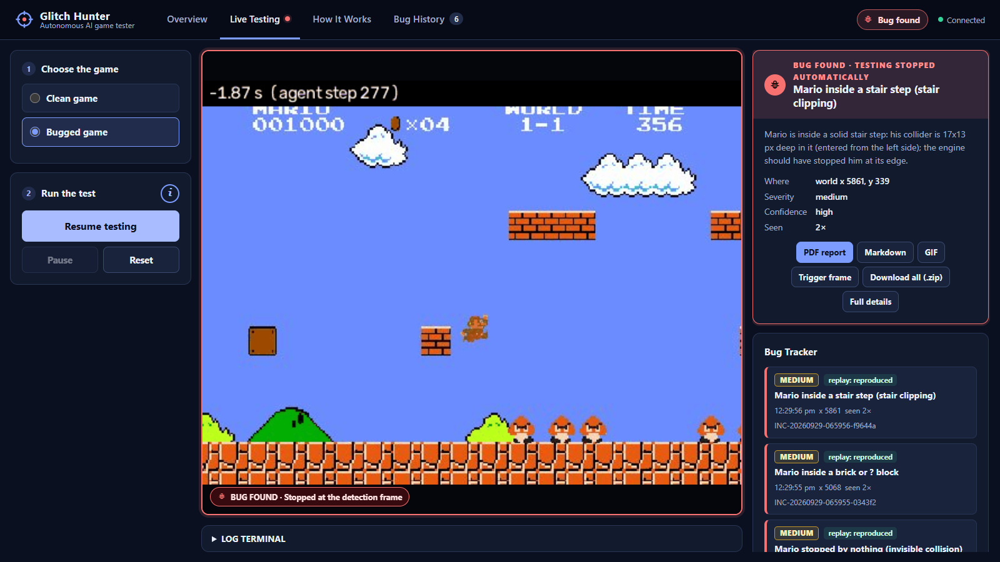
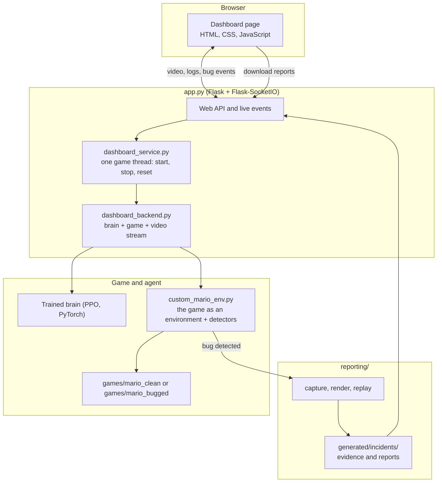

<h1 align="center">Glitch Hunter</h1>

<p align="center">
  <b>An AI agent that plays Super Mario Bros Level 1-1, looks for game bugs by itself,<br>
  and writes a report for every bug it finds.</b>
</p>

<p align="center">
  <a href="https://github.com/TanmaySingh2711/glitch_hunter_project/actions/workflows/ci.yml"></a>
  
  
</p>

<p align="center">
  
</p>

There is no hosted demo. The project runs on your own computer, and the setup is one click (see [Installation](#installation)).

---

## Table of Contents

- [Overview](#overview)
- [The Problem](#the-problem)
- [Objectives](#objectives)
- [Key Features](#key-features)
- [Tech Stack](#tech-stack)
- [Architecture](#architecture)
- [How It Works](#how-it-works)
- [Project Structure](#project-structure)
- [Requirements](#requirements)
- [Installation](#installation)
- [Configuration](#configuration)
- [How to Run](#how-to-run)
- [Usage](#usage)
- [Sample Output](#sample-output)
- [API](#api)
- [Model Details](#model-details)
- [Results](#results)
- [Screenshots](#screenshots)
- [Limitations](#limitations)
- [More Documentation](#more-documentation)
- [Contributing](#contributing)
- [License](#license)
- [Author](#author)
- [Acknowledgements](#acknowledgements)

---

## Overview

Glitch Hunter is a game tester that needs no human at the controls.

A trained AI agent plays Level 1-1 of a Super Mario Bros clone. While it
plays, a set of checks watches the game. When the game breaks one of its own
rules, for example Mario sinks into a solid block, testing stops. The project
then saves a screenshot and a short GIF of that moment, plays the same run
again to confirm the bug really happens, and writes a report in Markdown and
PDF. The report also points to the lines in the game's code that most likely
cause the bug.

You watch all of this live in a browser dashboard.

In short: **play, detect, save evidence, replay, report.**

---

## The Problem

Testing a game by hand is slow. A person has to play the same level again and
again and wait for the rare moment where something goes wrong. Then they have
to describe it well enough for someone else to see it too.

Glitch Hunter does that job for one level of one game: it plays, notices when
something is wrong, and hands over evidence that another person can check.

---

## Objectives

1. **Train an agent that finishes the level by itself.**
2. **Teach it to explore like a tester**, so it visits as much of the
   reachable level as it can, without losing the skill to finish it.
3. **Detect bugs automatically** and turn each one into a report with
   evidence that can be reproduced.

Each one has its own write-up: [Objective 1](docs/OBJECTIVE1.md),
[Objective 2](docs/OBJECTIVE2.md), [Objective 3](docs/OBJECTIVE3.md).

---

## Key Features

| Feature | What it does |
|---|---|
| **Self-playing agent** | A trained brain plays the level with no human input |
| **Bug detectors** | 13 rules checked on every game frame: no passing into solid things, no invisible walls, no enemy hits or stomps without contact, no impossible jumps, and a few more |
| **Stops on every bug** | Testing pauses at the exact frame a rule breaks |
| **Saved evidence** | A full-size screenshot, a GIF of the moments before, and the full record of the run |
| **Replay check** | The run is played again in a separate process to confirm the bug happens on the same frame |
| **Reports** | A Markdown and a PDF report for every bug |
| **Where to fix it** | Each report names the file and lines in the game's code that likely cause the bug, and the edit to make. It is a lead, not a proven cause |
| **Live dashboard** | Watch the game, see what the agent is doing, and open every report from the browser. A retro arcade look: black and green, a pixel font and a few animations |
| **Bug History** | Every saved bug and clean-run report in one place, with a Delete button for each and a Clear history button |
| **Two games** | A clean game and a copy with six bugs added on purpose, to prove the detectors work |
| **A new route every run** | On both games the agent does not repeat the same path, so more of the level gets tested. On the bugged game each run meets its own set of the planted bugs |
| **Clean-run report** | When a clean-game run reaches the castle with no bug, it gets its own short report |
| **Works offline** | No internet is needed after installing |

---

## Tech Stack

| Area | What is used |
|---|---|
| Language | Python 3.12 |
| Game | Pygame 2.6.1 (the Mario clone) |
| AI / ML | Stable-Baselines3 2.9.0 (PPO), PyTorch 2.14.0, Gymnasium 1.3.0 |
| Data | NumPy 2.5.2, cloudpickle 3.1.2, JSON files |
| Images | OpenCV 5.0 (frames, screenshots), Pillow 12.3 (GIFs) |
| Reports | fpdf2 2.8.8 (PDF), Markdown |
| Backend | Flask 3.1.3, Flask-SocketIO 5.6.1 |
| Frontend | HTML, CSS, plain JavaScript, Socket.IO client and the Press Start 2P pixel font (both bundled in the repo) |
| Packaging | pip (`requirements.txt`) or uv (`pyproject.toml`, `uv.lock`) |
| Code quality | pytest, pytest-cov, Ruff, mypy (strict), pre-commit |
| CI | GitHub Actions on Ubuntu, Windows and macOS |
| Optional | TensorBoard, only to view training graphs |

There is no database. Everything is saved as plain files.

---

## Architecture


```mermaid
flowchart TD
    subgraph Browser
        UI["Dashboard page<br/>HTML, CSS, JavaScript"]
    end
    subgraph Server["app.py (Flask + Flask-SocketIO)"]
        API["Web API and live events"]
        SVC["dashboard_service.py<br/>one game thread: start, stop, reset"]
        BACK["dashboard_backend.py<br/>brain + game + video stream"]
    end
    subgraph Game["Game and agent"]
        ENV["custom_mario_env.py<br/>the game as an environment + detectors"]
        VAR["games/mario_clean or games/mario_bugged"]
        BRAIN["Trained brain (PPO, PyTorch)"]
    end
    subgraph Reporting["reporting/"]
        PIPE["capture, render, replay"]
        STORE["generated/incidents/<br/>evidence and reports"]
    end
    UI <-->|video, logs, bug events| API
    UI -->|download reports| API
    API --> SVC --> BACK
    BACK --> BRAIN
    BACK --> ENV --> VAR
    ENV -->|bug detected| PIPE --> STORE
    STORE --> API
```

| Part | Files | Job |
|---|---|---|
| Dashboard | `app.py`, `dashboard_service.py`, `dashboard_backend.py`, `dashboard_facts.py`, `web/` | Serves the page, streams the game, pauses on bugs, serves the reports |
| Game and agent | `custom_mario_env.py`, `agent_logic.py`, `rewards/` | Runs the game one frame at a time, applies the brain's moves, runs the detectors |
| Exploration | `exploration/` | Tracks where Mario has been and which places he can reach; holds every tuned setting (`config.py`) |
| Evaluation | `evaluation/` | Measures how often a brain finishes the level |
| Reporting | `reporting/` | Detectors, evidence, GIF/Markdown/PDF reports, replay, fix hints |
| Training | `train_agent.py`, `training/` | Trains the brain (not needed to use the project) |

More detail: [docs/ARCHITECTURE.md](docs/ARCHITECTURE.md).

---

## How It Works

1. **The game runs as an environment.** The Mario clone is wrapped so a
   program can press its buttons and read its screen.
2. **The brain picks a move.** It looks at the last four frames (small,
   grayscale) and chooses one of 10 moves, such as walk right, run, or jump.
3. **The game moves forward** by four frames with that move held.
4. **The detectors check each frame.** They compare what the game did with
   what is drawn on screen. Is Mario inside a solid block? Was he stopped by
   nothing? Did an enemy hurt him, or get stomped, without touching him? Did
   he jump higher than the game allows?
5. **If a rule breaks, testing stops.** The game screen holds that frame.
   The screenshot, the recent frames and every button press of the run are
   saved.
6. **The run is replayed.** A separate process repeats the same button
   presses to check that the bug shows up again on the same frame.
7. **The reports are written:** a GIF, a Markdown report and a PDF. They
   include a "Where to fix it" part, worked out by reading the game's source
   code together with what the detector measured.
8. **The dashboard shows the bug** and adds it to the Bug Tracker. You can
   open the files, then resume testing.

The detectors are general rules. None of them knows where a bug was planted.

---

## Project Structure

```text
glitch_hunter_project/
├── setup.bat, setup.sh         # one-click setup (Windows / Linux and macOS)
├── run_dashboard.bat           # Windows: double-click to start the dashboard
├── app.py                      # the dashboard server (start here)
├── dashboard_service.py        # the single game thread: start, stop, reset
├── dashboard_backend.py        # loads the brain, runs the game, streams video
├── dashboard_facts.py          # the numbers shown on the Overview tab
├── custom_mario_env.py         # the game as an environment, plus detectors
├── agent_logic.py              # reward wrapper used in training
├── game_window.py, desktop.py  # game-window and Windows desktop helpers
├── train_agent.py              # training script (optional)
│
├── games/
│   ├── mario_clean/            # the original game, never changed
│   └── mario_bugged/           # a copy with six bugs added on purpose
│
├── reporting/                  # detectors, evidence, reports, replay, fix hints
├── exploration/                # coverage map, reachable area, config.py
├── evaluation/                 # level-completion measurement
├── rewards/                    # training rewards
├── training/                   # training callbacks and checkpoint helpers
├── common/                     # logging and safe file writes
├── tools/                      # command-line tools (see tools/README.md)
├── web/                        # the dashboard page: templates/ and static/
├── tests/                      # automated tests
├── docs/                       # documentation and README images
├── generated/                  # created while running, not in git:
│                               #   incidents/, run_reports/, logs/, caches
│
├── glitch_hunter_main_brain.zip           # the trained brain the dashboard uses
├── glitch_hunter_main_brain_coverage.npz  # its saved exploration map
├── artifacts.json              # SHA-256 hashes of the protected files
├── requirements.txt            # dependencies for pip
└── pyproject.toml, uv.lock     # dependencies for uv, and tool settings
```

---

## Requirements

| Need | Notes |
|---|---|
| **Python 3.12** | Exactly 3.12, not 3.11 or 3.13. On Windows, `setup.bat` installs it for you if it is missing |
| **Git** | To clone the repo. Or download the ZIP from GitHub instead |
| **Operating system** | Windows 10/11 is the main, fully checked platform. Linux and macOS are checked by CI: the setup runs, the dashboard starts, and the fast tests pass |
| **GPU** | Not needed to run the dashboard. An NVIDIA GPU only makes training faster |
| **Disk space** | About 5 GB with the GPU build of PyTorch. The CPU build, which the setup script uses by default, is much smaller |
| **Linux only** | OpenCV needs the system library `libgl1` |
| **Windows only** | Keep the project in a short folder path, such as `C:\glitch_hunter_project`. `setup.bat` stops if the path is over 100 characters, because the install can fail on long paths |

No account, API key or database is needed.

---

## Installation

### Quick way (recommended)

**Windows**

1. Get the project:
   ```bash
   git clone https://github.com/TanmaySingh2711/glitch_hunter_project.git
   ```
   No Git? On GitHub click **Code**, then **Download ZIP**, and unzip it.
2. Open the folder and double-click **`setup.bat`**.
3. Wait a few minutes. The dashboard then opens in your browser by itself.

**Linux / macOS**

```bash
git clone https://github.com/TanmaySingh2711/glitch_hunter_project.git
cd glitch_hunter_project
bash setup.sh
```

What the script does:

1. Finds Python 3.12. On Windows it installs it with `winget` if missing. On
   Linux and macOS it tells you the command to install it.
2. Creates an environment called `venv_gpu` inside the project folder.
3. Installs PyTorch (the CPU build) and the other libraries.
4. Checks that the brain files are there, and downloads them if not.
5. Starts the dashboard.

Running it again only adds what is missing. Two optional words can follow the
script name: `gpu` installs the NVIDIA build of PyTorch (for training), and
`norun` installs without starting the dashboard.

### By hand

```bash
# 1. Clone
git clone https://github.com/TanmaySingh2711/glitch_hunter_project.git
cd glitch_hunter_project

# 2. Create the environment (the scripts expect the name venv_gpu)
py -3.12 -m venv venv_gpu          # Windows
python3.12 -m venv venv_gpu        # Linux / macOS

# 3. Activate it
venv_gpu\Scripts\activate          # Windows
source venv_gpu/bin/activate       # Linux / macOS

# 4. Install PyTorch first - pick ONE line
pip install torch==2.14.0 --index-url https://download.pytorch.org/whl/cu126   # NVIDIA GPU
pip install torch==2.14.0 --index-url https://download.pytorch.org/whl/cpu     # CPU, Windows / Linux
pip install torch==2.14.0                                                      # macOS

# 5. Install everything else
pip install -r requirements.txt

# 6. Linux only
sudo apt-get install -y libgl1
```

PyTorch goes first because on Windows the default package index only has the
CPU build. Please do not install `eventlet`; the dashboard is built to run
without it.

If you use [uv](https://docs.astral.sh/uv/), `uv sync --active` inside the
activated `venv_gpu` installs the exact versions from `uv.lock` (with the GPU
build of PyTorch) in one command.

### The brain files

The trained brain comes with the repo, so there is nothing to download. To
check the files are the right ones:

```bash
python tools/verify_artifacts.py
```

If they are ever missing, this command downloads them from the repo's
`v1.0.0` release (about 23 MB) and checks them:

```bash
python tools/final_brain.py install
```

### Check that it works

```bash
python app.py --help
```

It should print the dashboard's options.

---

## Configuration

There is no `.env` file and nothing you must set. The defaults work.

Two optional environment variables:

| Variable | Default | What it does |
|---|---|---|
| `GLITCH_HUNTER_PORT` | `5000` | The port the dashboard uses |
| `GLITCH_HUNTER_HOST` | `127.0.0.1` | Set to `0.0.0.0` to let other devices on your network open the dashboard. It has no password, so only do this on a network you trust |

Command-line options for `app.py`:

| Option | What it does |
|---|---|
| `--game mario_clean` or `--game mario_bugged` | Which game to start on (default: clean) |
| `--incidents-dir PATH` | Save bug evidence somewhere other than `generated/incidents/` |
| `--run-reports-dir PATH` | Save clean-run reports somewhere other than `generated/run_reports/` |
| `--no-reproduce` | Skip the replay step. Faster; reports are still written |
| `--desktop` | Used by `run_dashboard.bat`: keeps a laptop at full speed on battery while the dashboard runs |
| `--synthetic-probe X` | For testing the report pipeline only: raises a clearly labelled fake bug at position X |

The values that tune the agent and the detectors all live in
`exploration/config.py`, each with a note on where it came from.

---

## How to Run

**Windows:** double-click **`run_dashboard.bat`**. A terminal opens, and your
browser opens the dashboard when it is ready.

**Any system, from a terminal** (with `venv_gpu` activated):

```bash
python app.py                      # starts on the clean game
python app.py --game mario_bugged  # starts on the bugged game
```

Then open **http://localhost:5000**.

There is only one process to start. The server, the game and the agent all
run inside it.

**To stop:** press `Ctrl + C` in the terminal, or close that window.

---

## Usage

The page has four tabs: **Overview**, **Live Testing**, **How It Works** and
**Bug History**. Testing happens in **Live Testing**.

1. Choose **Clean game** or **Bugged game**.
2. Click **Start testing**. The game shows in the middle of the page. The
   **Live status** panel tells you what the agent is doing.
3. **When a bug is found, testing stops.** The game screen holds that frame,
   with *BUG FOUND* in its top-left corner. A **Bug found** card appears with
   the bug, where it happened, where to fix it, and links to its files.
4. Open the **PDF report**, **Markdown** report, **Trigger frame**, **GIF**,
   or **Download all (.zip)**. A report still being written shows as
   *writing…* and fills in by itself.
5. Click **Resume testing** to continue from the same moment.

What to expect:

- **Clean game:** the Bug Tracker should stay empty. That is the healthy
  result. A run ends when Mario reaches the castle or dies. A castle finish
  holds the last frame, with *LEVEL COMPLETE* in its corner, and shows a
  green *Level complete · No bugs found* card with a run report. Click
  **Start next run** to play again.
- **Bugged game:** every run takes a new route and meets its own set of the
  planted bugs, usually several (see [Results](#results)); press **Resume
  testing** after each one. Most runs still reach the castle.
- A run that gets stuck is ended after about 13 seconds without progress.
- **Reset** clears the page. Saved evidence stays on disk.

**Bug History** lists every bug and run report saved on disk. Each row has a
**Delete** button, and each list has a **Clear history** button. The dashboard
asks first, because the files are removed from disk and cannot be brought
back. It will not delete the bug or run that Live Testing is stopped on right
now (press **Resume** or **Reset** first), or a report that is still being
written.

You can also look at saved bugs from a terminal:

```bash
python tools/incidents.py list            # every saved bug, newest first
python tools/incidents.py show <INC-id>   # one bug's summary and files
python tools/incidents.py verify          # re-check every file against its hash
```

---

## Sample Output

Every bug gets its own folder, `generated/incidents/INC-<date>-<time>-<id>/`:

| File | What is in it |
|---|---|
| `trigger.png` | The exact frame where the bug was detected |
| `context.gif` | The moments leading up to it |
| `report.md`, `report.pdf` | The bug report |
| `incident.json` | The full record: which rule broke, the measurements, the place, which game and brain |
| `trajectory.json`, `context_frames.zip` | Mario's state and the frames before the bug |
| `reproduction.json` | The replay result |
| `manifest.json` | A SHA-256 hash of every file |

This is the "Where to fix it" part the project produces for the planted
sky-jump bug (taken from a real run of the fix-hint code on the test data in
`tests/fix_hint_incidents.json`):

```json
{
  "summary": "Mario rose at 23.1 px/frame; the engine's fastest jump is 12.5. Something at take-off makes the jump too strong.",
  "where": "games/mario_bugged/data/components/mario.py line 490 in standing()",
  "fixes": [
    { "where": "games/mario_bugged/data/components/mario.py line 490 in standing()", "fix": "Delete line 490." },
    { "where": "games/mario_bugged/data/components/mario.py line 603 in walking()", "fix": "Delete line 603." }
  ]
}
```

A clean-game run that reaches the castle is saved in
`generated/run_reports/RUN-<date>-<time>-<id>/` with `run.json`, `final.png`,
`finish.gif`, `report.md` and `report.pdf`.

---

## API

The dashboard page talks to a small local API. You do not need it to use the
project, but it is there if you want to read the data yourself. These are
`GET` and return JSON unless noted.

| Endpoint | Returns |
|---|---|
| `/api/status` | Whether testing is running, why it paused, the bug that stopped it, and which game and brain are loaded |
| `/api/project` | The facts shown on the Overview tab |
| `/api/incidents` | Bugs found in this session. Add `?all=1` for every bug saved on disk |
| `/api/incidents/<id>` | The full detail of one bug |
| `/api/runs` | Every clean-run report on disk |
| `/incidents/<id>/<file>` | One evidence file (PNG, GIF, PDF, JSON) |
| `/incidents/<id>/bundle.zip` | All evidence for one bug as a ZIP |
| `/runs/<id>/<file>`, `/runs/<id>/bundle.zip` | The same for a clean-run report |
| `/healthz` | A simple health check |
| `DELETE /api/incidents/<id>` | Deletes one saved bug |
| `DELETE /api/incidents` | Deletes every saved bug (Clear history) |
| `DELETE /api/runs/<id>`, `DELETE /api/runs` | The same for clean-run reports |

Example:

```bash
curl http://localhost:5000/api/status
```

The response includes fields such as `testing`, `steps`, `pause_reason`,
`bug_found`, `run_result`, `brain_path` and `brain_approved`.

A delete answers with `deleted` (the ids removed) and `kept` (the ids left
alone, each with the reason).

Start, pause, reset and switching the game go over Socket.IO events
(`start_testing`, `stop_testing`, `reset_game`, `switch_game`), which is how
the page's buttons work.

---

## Model Details

| | |
|---|---|
| **Method** | PPO (Proximal Policy Optimization), a reinforcement-learning method, from Stable-Baselines3 |
| **Network** | A small convolutional network (`CnnPolicy`) |
| **Input** | The last 4 game frames, each shrunk to 84×84 and turned grayscale |
| **Output** | One of 10 moves (walk, run, jump and their combinations) |
| **Step size** | One move is held for 4 game frames |
| **Training** | 8 copies of the game running side by side |

There is no dataset. The agent learns by playing the game and getting a
reward for what it does.

Training happened in two stages:

- **Stage 1, 6 million steps.** Rewarded for moving forward and reaching the
  flag. The result finishes the level by itself.
- **Stage 2, on to 16 million steps in total.** Started from the stage 1 brain and was
  rewarded for reaching places it had not visited before. After every
  training update, a "stay close" step keeps it near a known good brain, so
  it does not forget how to finish the level.

The stage 2 brain, `glitch_hunter_main_brain.zip`, is the one the dashboard
uses. The dashboard only loads it if its hash matches the recorded one.

On the dashboard the brain does not always take its top choice. It picks each
move from the chances it learned, so every run takes a different route.

Training is **not** needed to use the project, and it takes many hours. See
[tools/README.md](tools/README.md) if you want to train.

---

## Results

All numbers below were measured in this project and are recorded in its files
and docs.

**The agent**

| | Stage 1 brain (6M steps) | Final brain (16M steps) |
|---|---|---|
| Finishes the level (500 test runs) | 46.8% (234 / 500) | 56.6% (283 / 500) |

The final brain has covered 84.25% of the reachable level (3,166,235 of
3,757,990 pixels).

On the dashboard, where each run takes a new route, 77% of 140 measured
clean-game runs reached the castle. On the bugged game, 30 of 40 measured
runs reached the castle (31 of 40 on the clean game with the same seeds), 39
of 40 met at least two of the six planted bugs, and 4 met all six.

**Bug detection**

Six bugs were added on purpose to `games/mario_bugged/` to test the detectors.
Each one is declared in
[`INJECTED_BUGS.json`](games/mario_bugged/INJECTED_BUGS.json). They sit where
the agent's routes pass, and none of them traps or kills Mario, so a run can
meet several and still finish.

| # | Planted bug | What goes wrong |
|---|---|---|
| 1 | Stair clipping | Mario sinks into the top of two stair columns |
| 2 | Pipe clipping | Mario sinks 32 px into the top of the fourth pipe |
| 3 | Ceiling clipping | Mario jumps straight through a brick |
| 4 | Invisible wall | A one-block wall that is not drawn stops Mario |
| 5 | Stomp from too far | A Goomba is stomped from up to 36 px above its head, without being touched |
| 6 | Sky jump | One jump throws Mario far above the screen |

| | Clean game | Bugged game |
|---|---|---|
| Result | 0 bug reports across 101 runs, and 0 in 80 more runs after the stomp check was added | All 6 bugs detected, reproduced and reported |

**Fix hints.** The 11 edits suggested for the six planted bugs were applied
to a copy of the bugged game. After that, every bug's spot behaved exactly
like the clean game (`tests/test_fix_hint.py`).

**Code checks.** 888 automated tests. The full check
(`python tools/check.py --full`) requires at least 90% test coverage.

---

## Screenshots

**Testing the clean game.** The Live status panel says what the agent is
doing. The Bug Tracker stays empty, as it should.

<p align="center"></p>

**Stopped on a bug** (stair clipping, on the bugged game). The game screen
holds the frame the bug was found on; the card on the right says where to fix
it.

<p align="center"></p>

**A GIF the pipeline saved for the same bug.** Mario lands and sinks into the
stair column. The last frame is the exact frame the bug was detected.

<p align="center"></p>

---

## Limitations

- **One game, one level.** It works on Level 1-1 of this Mario clone only.
  The detectors compare the game with a description of that level
  (`reporting/level1_design.json`).
- **Tested on planted bugs.** The six bugs were added on purpose. How well it
  catches other kinds of bugs has not been measured.
- **The fix hint is a lead.** It knows six kinds of cause. The report labels
  it "inferred, not proven", and a person still has to apply and test the fix.
- **The agent does not always finish.** Some runs die early or get stuck, so
  the end of the level is tested less often than the start.
- **Not all of the level is covered.** Training stopped at 84.25% of the
  reachable area.
- **A clean report is not a guarantee.** "No bugs found" means no rule broke
  on that run, not that the game has no bugs.
- **No login.** The dashboard is meant for your own computer.
- **Windows first.** A few desktop extras (window placement, full speed on
  battery) are Windows only.

---

## More Documentation

| Document | What it covers |
|---|---|
| [docs/OBJECTIVE1.md](docs/OBJECTIVE1.md) | The first brain: how it was trained and how it did |
| [docs/OBJECTIVE2.md](docs/OBJECTIVE2.md) | The exploring brain: the work, the problems found, why training stopped |
| [docs/OBJECTIVE3.md](docs/OBJECTIVE3.md) | Detectors, the report pipeline, the planted bugs |
| [docs/ARCHITECTURE.md](docs/ARCHITECTURE.md) | The parts of the project and how they fit |
| [docs/PERFORMANCE.md](docs/PERFORMANCE.md) | Time and memory use |
| [docs/SECURITY.md](docs/SECURITY.md) | What the dashboard exposes and how it is kept safe |
| [docs/THIRD_PARTY_NOTICES.md](docs/THIRD_PARTY_NOTICES.md) | Terms for the game code, its assets and the libraries |
| [tools/README.md](tools/README.md) | Every command-line tool |
| [games/mario_bugged/VARIANT.md](games/mario_bugged/VARIANT.md) | The planted bugs and the rules for changing the bugged game |
| [docs/Glitch_Hunter_Tech_Stack.pdf](docs/Glitch_Hunter_Tech_Stack.pdf) | Every technology, folder and file, and where each is used |
| [docs/Glitch_Hunter_Panel_QA.pdf](docs/Glitch_Hunter_Panel_QA.pdf) | Common questions about the project, with short answers |

---

## Contributing

Contributions are welcome.

1. Fork the repository.
2. Create a branch: `git checkout -b my-change`
3. Make your change.
4. Install the developer tools and run the checks:
   ```bash
   pip install pytest==9.1.1 pytest-cov==7.1.0 ruff==0.16.6 mypy==2.3.1 pre-commit==4.6.2
   python tools/check.py
   ```
5. Commit, push, and open a pull request.

Two rules to know: never edit `games/mario_clean/`, and do not commit
anything from `generated/`. The rest is in
[docs/CONTRIBUTING.md](docs/CONTRIBUTING.md).

---

## License

The project's own code, docs and trained brain files are under the **MIT
License**. See [LICENSE](LICENSE).

Some things in this repo are **not** covered by it:

| Part | Terms |
|---|---|
| `games/mario_clean/`, `games/mario_bugged/` | The Mario clone by Justin Meister. It was published without an open-source license, and its author describes it as meant for non-commercial, educational use. Do not use it commercially |
| Game graphics, music and sounds | Nintendo's property (*Super Mario Bros.*). They also appear in the screenshots and reports. This project is not connected to or endorsed by Nintendo |
| `web/static/vendor/socket.io.min.js` | The Socket.IO client, under its own MIT license |
| `web/static/vendor/fonts/` | The Press Start 2P font, under the SIL Open Font License 1.1 (`OFL.txt` beside it) |

Full details: [docs/THIRD_PARTY_NOTICES.md](docs/THIRD_PARTY_NOTICES.md).

---

## Author

**Tanmay Singh** · [github.com/TanmaySingh2711](https://github.com/TanmaySingh2711)

---

## Acknowledgements

- **Justin Meister** for [Mario-Level-1](https://github.com/justinmeister/Mario-Level-1),
  the Pygame clone this project is built on.
- **Nintendo**, creator of *Super Mario Bros.*, whose artwork and audio the clone uses.
- **Stable-Baselines3**, **PyTorch** and **Gymnasium** for the training tools.
- **Pygame** for the game engine.
- **Flask**, **Flask-SocketIO** and **Socket.IO** for the live dashboard.
- **NumPy**, **OpenCV**, **Pillow** and **fpdf2** for numbers, images, GIFs and PDFs.
