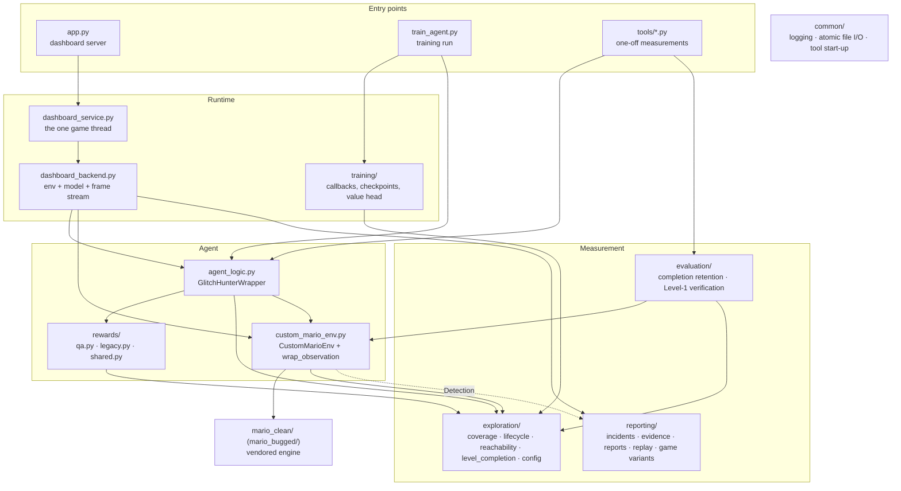

# Architecture

(Time and memory per worker: [PERFORMANCE.md](PERFORMANCE.md).)

How the pieces of Glitch Hunter fit together, what each one owns, and the
invariants that hold across them. The module docstrings carry the detail and
the measurements behind every number; this page is the map.

## Layers

Dependencies only point downward. Nothing in `exploration/` imports the
agent, nothing in `rewards/` imports the trainer, and the game directories are never
modified - everything the project needs from the engine is read from outside
(`CustomMarioEnv`, `reachability.rasterize_solids`). `common/` knows nothing
about Mario at all.

## One substep

`CustomMarioEnv.step()` advances the engine one 60 fps frame. The agent acts
once per **4** frames (`SkipObservation` - Gymnasium's MaxAndSkip, rendering
only the frames it keeps - config `SUBSTEPS_PER_AGENT_STEP`), and
`GlitchHunterWrapper` sits *below* that skip, so it sees every frame:

1. **Respawn rule** (QA only) - `CustomMarioEnv.hold_clock()` keeps the engine
   timer above zero. Time alone never ends a QA episode.
2. **Engine step** - keys from the action, one engine update, the info dict
   (world-space collider, velocity, score, death, clock), glitch detection.
3. **Coverage** - `SpatialCoverage.record()` marks the collider's swept box in
   the persistent world-pixel bitmap and returns how many *testable* pixels
   were new. Recorded in both modes whenever coverage is attached.
4. **Lifecycle** (QA only) - `EpisodeLifecycle.observe()` folds the substep
   into the current 240-step window, closes windows, moves EXPLORE ->
   COMPLETE, and gathers the stagnation evidence the safety reset needs.
5. **Reward** - `rewards/qa.py` or `rewards/legacy.py`, chosen by the mode.
6. **Annotate** - the lifecycle writes its state into `info` on every
   substep, because the skip keeps only the last of four info dicts.

## Two objectives, one switch

`exploration/config.py REWARD_MODE` selects the objective, and everything
else follows from it:

| | `qa_exploration` (current) | `legacy_completion` (the 6M brain) |
|---|---|---|
| reward | new testable world pixels; phase-gated EXPLORE -> COMPLETE | tiles, milestones, flag +500 - preserved bit for bit |
| episode ends | castle door, death, or evidence-based safety reset | engine timer, death, stuck rule, TimeLimit |
| writes | `glitch_hunter_qa.zip`, `checkpoints_qa/` | `mario_brain_checkpoint.zip`, `checkpoints/` |
| training stops | Level 1 fully covered (3,757,990 px), or a safety cap | 6,000,000 steps |

The dashboard ignores the switch and shows a brain under that brain's own
reward (`dashboard_backend.select_checkpoint`): the main brain
(`glitch_hunter_main_brain.zip`) when its SHA-256 matches the closure
record, else a working QA brain, else the 6M brain.

## Invariants

These are enforced in code and pinned by tests; changing one is a design
decision, not a refactor.

* **The denominator is `config.TESTABLE_TOTAL` (3,757,990).** Coverage percent is always
  `covered_testable / TESTABLE_TOTAL`, and Level 1 is complete only on integer
  equality (`level_completion.is_level_complete`). The mask is fingerprinted;
  a coverage file recorded against a different mask refuses to load.
* **A checkpoint and its coverage are a matched pair.** Saved model-first,
  coverage-second, flag-last; loaded only after `load_verified` has checked
  fingerprint, denominator, config hash, the bitmap's own counts and the
  checkpoint's timestep. Nothing is ever reset or repaired silently.
* **The 6M master is never written in QA mode.** QA reads it once to seed
  itself; it is also the baseline every tool and slow test loads
  (`config.BASELINE_MODEL`), and git is its backup.
* **Time alone never ends a QA episode.** Only the castle door, a death, or
  the safety reset - which needs positive stagnation evidence (a drought,
  consecutive non-transit zero-yield windows, and no progress across them),
  never elapsed steps.
* **Time alone never changes the OBJECTIVE either.** `EXPLORE -> COMPLETE`
  fires only on T1 (an informed target met with discovery genuinely
  declining, off transit), T2 (three consecutive exhausted, non-transit
  windows) or T3 (nothing reachable left ahead). The time-only T4 backstop
  that switched at 7,335 agent steps is retired and nothing replaced it, so
  an episode that keeps finding pixels - or keeps coherently crossing old
  ground toward the frontier - stays in EXPLORE however long it runs.
* **An anomaly must be impossible, not merely unexplained.** Out-of-mask
  pixels are classified once, at mask-build time, and only the genuinely
  impossible classes reach the glitch system. Three measured false-positive
  causes have been corrected, none of them by widening `PENETRATION_TOL`:
  `mutable_solid` (the level's geometry is not constant - 29 of 31 bricks are
  destroyed outright by big Mario, and every brick and coin box rises 18 px
  while bumped); `sweep_artifact` (`record()` marks the bounding box of two
  consecutive collider rects, so a diagonal move past a convex corner records
  pixels neither rect occupied); and the pit rule, which now asks whether the
  bottom of a column holds a floor rather than whether the column is empty
  top to bottom - bricks floating at y 193 were making the pit beneath them
  look solid, so ordinary pit deaths there read as `floor_clip`.
  `sweep_artifact` is filed as a MODEL GAP, not as normal engine behaviour,
  because it describes a limit of the evidence rather than anything the game
  did.
* **Console reward statistics describe the objective in force.** SB3 pickles
  `ep_info_buffer` into the checkpoint and `PPO.load()` restores it, so a QA
  resume inherits 100 legacy episodes on a completely different reward scale.
  `build_model` clears it for QA resumes only; legacy resumes keep theirs,
  since there the episodes are the same objective.
* **Coverage is exact, reward is best-effort.** The shared bitmap is written
  lock-free by 8 worker processes; metrics are recomputed from it by the
  parent, so they are exact even though two workers can both be paid for the
  same virgin pixel.
* **One thread owns the game window.** On Windows a window dies with the
  thread that created it, so every window and env call in the dashboard runs
  on `dashboard_service`'s single game thread.
* **One game variant at a time, and the clean one is pinned.** Both
  variants import as `data`; `claim_game_variant` refuses to mix them, and
  the dashboard's switch unloads one completely (`release_game_variant`)
  before loading the other.
  `mario_clean/` must match `CLEAN_GAME_TREE_SHA256`; `mario_bugged/` may differ
  only where `INJECTED_BUGS.json` says (docs/objective3/README.md).
* **Observing never changes the game.** Evidence (Objective 3) is off unless
  enabled and only reads the engine when on; an episode is identical either way.
* **An incident is on disk before testing stops.** `IncidentPipeline.capture`
  writes the raw evidence on the game thread; reports are derived afterwards,
  and their failure never loses the incident. Evidence is never overwritten.

## Persistent artifacts

| Path | Written by | In git | Notes |
|---|---|---|---|
| `mario_brain_checkpoint.zip` | legacy training | yes | the 6M brain; SHA-256 `690d5702…a188b3` |
| `glitch_hunter_main_brain.zip` + `_coverage.npz` | Objective 2 (renamed at clean-up) | no | **THE MAIN BRAIN**: the approved 16M QA brain and its coverage, read-only; a backup copy sits in `checkpoints_qa/final_objective2_16000000/` |
| `checkpoints/` | legacy training (only if re-run) | no | legacy milestones; none are kept |
| `exploration_data/reachable_mask.npz` | `tools/build_reachability.py` | no | the testable mask + noncoverage class map |
| `exploration_data/jump_arcs.npz` | `tools/collect_jump_arcs.py` | no | 228 real engine jump arcs - an input to the mask (the real-arc envelope) |
| `exploration_data/observed_reach.npz` | `tools/build_reachability.py --tighten` | no | real play the arc envelope denies, kept testable so a denominator change loses no pixel |
| `exploration_data/coverage_bootstrap_6000000_mask_v4.npz` | `tools/bootstrap_coverage.py`, re-stamped by `tools/migrate_coverage.py` | no | the QA campaign's starting map (`config.BOOTSTRAP_COVERAGE`) |
| `exploration_data/anchor_states.npz` | `tools/build_anchor_set.py` | no | the states `AnchorConsolidationCallback` holds KL against |
| `checkpoints_qa/`, `glitch_hunter_qa*.{zip,npz}` | QA training | no | matched model/coverage pairs |
| `checkpoints_qa/final_objective2_16000000/` | by hand at closure | no | **frozen**: the closure record, the evidence, and a read-only backup of the main brain. See `docs/objective2/WORKLOG.md` |
| `checkpoints_qa/coverage_audit_trail.jsonl` | QA training | no | append-only coverage growth, one line per 10k steps |
| `checkpoints_qa/reward_telemetry.jsonl` | QA training | no | append-only reward books: one line per episode (channels per phase) + 10k-step summaries |
| `evaluation/completion_baseline_6M.json` | `tools/evaluate_completion.py --make-baseline` | yes | the frozen retention protocol and thresholds |
| `logs/train.log` | QA / legacy training | no | the run's full log |
| `evaluation/results/`, `coverage_audits/`, `calibration_runs/` | the tools (see `tools/README.md`) | no | one regenerable record per run |
| `incidents/` | the dashboard (`reporting/`) | no | one read-only evidence bundle per incident, plus `occurrences.jsonl`; NOT regenerable - it is evidence |

`tools/verify_artifacts.py` re-hashes every artifact that is present against
`artifacts.json` and reports any that drifted.

## Where to change what

| To change… | Edit | And run |
|---|---|---|
| a reward weight or threshold | `exploration/config.py` (the balance asserts run at wrapper construction) | `pytest tests/test_phase_reward.py tests/test_reward_qa.py` |
| the QA reward logic | `rewards/qa.py` | `pytest tests/test_reward_*.py tests/test_phase_reward.py` |
| when a QA episode ends | `exploration/lifecycle.py` | `pytest tests/test_episode_lifecycle.py` |
| what the dashboard shows | `dashboard_backend.py`, `static/`, `templates/` | `pytest tests/test_dashboard_control.py tests/test_concurrency.py tests/test_dashboard_incidents.py` |
| incidents, reports, replay | `reporting/` | `pytest tests/test_incident_*.py` then `python tools/validate_incident_pipeline.py` |
| the game itself (deliberate bugs) | `mario_bugged/` only, declared in `INJECTED_BUGS.json` | `pytest tests/test_game_variants.py` |
| training wiring | `train_agent.py`, `training/` | `pytest tests/test_level_completion.py tests/test_qa_resume.py` |
| anything | - | `python tools/check.py` |
