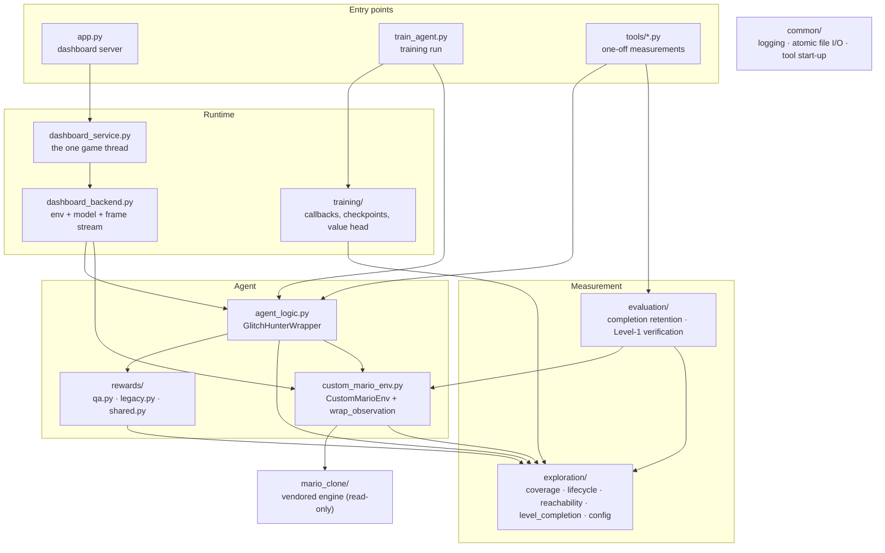

# Architecture

(Time and memory per worker: [PERFORMANCE.md](PERFORMANCE.md).)

How the pieces of Glitch Hunter fit together, what each one owns, and the
invariants that hold across them. The module docstrings carry the detail and
the measurements behind every number; this page is the map.

## Layers

Dependencies only point downward. Nothing in `exploration/` imports the
agent, nothing in `rewards/` imports the trainer, and `mario_clone/` is never
modified - everything the project needs from the engine is read from outside
(`CustomMarioEnv`, `reachability.rasterize_solids`). `common/` knows nothing
about Mario at all.

## One substep

`CustomMarioEnv.step()` advances the engine one 60 fps frame. The agent acts
once per **4** frames (`SkipObservation` - Gymnasium's MaxAndSkip, rendering
only the frames it keeps - config `SUBSTEPS_PER_AGENT_STEP`), and
`GlitchHunterWrapper` sits *below* that skip, so it sees every frame:

1. **Respawn rule** (QA only) - `CustomMarioEnv.hold_clock()` keeps the engine
   timer above zero. Time alone never ends a QA episode.
2. **Engine step** - keys from the action, one engine update, the info dict
   (world-space collider, velocity, score, death, clock), glitch detection.
3. **Coverage** - `SpatialCoverage.record()` marks the collider's swept box in
   the persistent world-pixel bitmap and returns how many *testable* pixels
   were new. Recorded in both modes whenever coverage is attached.
4. **Lifecycle** (QA only) - `EpisodeLifecycle.observe()` folds the substep
   into the current 240-step window, closes windows, moves EXPLORE ->
   COMPLETE, and gathers the stagnation evidence the safety reset needs.
5. **Reward** - `rewards/qa.py` or `rewards/legacy.py`, chosen by the mode.
6. **Annotate** - the lifecycle writes its state into `info` on every
   substep, because the skip keeps only the last of four info dicts.

## Two objectives, one switch

`exploration/config.py REWARD_MODE` selects the objective, and everything
else follows from it:

| | `qa_exploration` (current) | `legacy_completion` (the 6M brain) |
|---|---|---|
| reward | new testable world pixels; phase-gated EXPLORE -> COMPLETE | tiles, milestones, flag +500 - preserved bit for bit |
| episode ends | castle door, death, or evidence-based safety reset | engine timer, death, stuck rule, TimeLimit |
| writes | `glitch_hunter_qa.zip`, `checkpoints_qa/` | `mario_brain_checkpoint.zip`, `checkpoints/` |
| training stops | Level 1 fully covered (4,013,723 px), or a safety cap | 6,000,000 steps |

The dashboard ignores the switch and shows whichever brain is on disk under
that brain's own reward (`dashboard_backend.select_checkpoint`).

## Invariants

These are enforced in code and pinned by tests; changing one is a design
decision, not a refactor.

* **The denominator is 4,013,723.** Coverage percent is always
  `covered_testable / TESTABLE_TOTAL`, and Level 1 is complete only on integer
  equality (`level_completion.is_level_complete`). The mask is fingerprinted;
  a coverage file recorded against a different mask refuses to load.
* **A checkpoint and its coverage are a matched pair.** Saved model-first,
  coverage-second, flag-last; loaded only after `load_verified` has checked
  fingerprint, denominator, config hash, the bitmap's own counts and the
  checkpoint's timestep. Nothing is ever reset or repaired silently.
* **The 6M master is never written in QA mode.** QA reads it once to seed
  itself; `backup_6M/` holds a byte-identical copy, which is also the
  baseline every tool and slow test loads (`config.BASELINE_MODEL`).
* **Time alone never ends a QA episode.** Only the castle door, a death, or
  the safety reset - which needs positive stagnation evidence (a drought,
  consecutive non-transit zero-yield windows, and no progress across them),
  never elapsed steps.
* **Coverage is exact, reward is best-effort.** The shared bitmap is written
  lock-free by 8 worker processes; metrics are recomputed from it by the
  parent, so they are exact even though two workers can both be paid for the
  same virgin pixel.
* **One thread owns the game window.** On Windows a window dies with the
  thread that created it, so every window and env call in the dashboard runs
  on `dashboard_service`'s single game thread.

## Persistent artifacts

| Path | Written by | In git | Notes |
|---|---|---|---|
| `mario_brain_checkpoint.zip` | legacy training | yes | the 6M brain; SHA-256 `690d5702…a188b3` |
| `backup_6M/` | by hand | no | byte-identical copies of the 6M brain; `mario_brain_checkpoint.zip` there is `config.BASELINE_MODEL` |
| `checkpoints/` | legacy training | no | 400k … 6.0M milestones + `.flag` sentinels |
| `exploration_data/reachable_mask.npz` | `tools/build_reachability.py` | no | the testable mask + noncoverage class map |
| `exploration_data/coverage_bootstrap_6000000.npz` | `tools/bootstrap_coverage.py` | no | the QA campaign's starting map |
| `checkpoints_qa/`, `glitch_hunter_qa*.{zip,npz}` | QA training | no | matched model/coverage pairs |
| `evaluation/completion_baseline_6M.json` | `tools/evaluate_completion.py --make-baseline` | yes | the frozen retention protocol and thresholds |
| `logs/train.log` | QA / legacy training | no | the run's full log |
| `evaluation/results/`, `coverage_audits/`, `calibration_runs/` | the tools (see `tools/README.md`) | no | one regenerable record per run |

`tools/verify_artifacts.py` re-hashes every artifact that is present against
`artifacts.json` and reports any that drifted.

## Where to change what

| To change… | Edit | And run |
|---|---|---|
| a reward weight or threshold | `exploration/config.py` (the balance asserts run at wrapper construction) | `pytest tests/test_phase_reward.py tests/test_reward_qa.py` |
| the QA reward logic | `rewards/qa.py` | `pytest tests/test_reward_*.py tests/test_phase_reward.py` |
| when a QA episode ends | `exploration/lifecycle.py` | `pytest tests/test_episode_lifecycle.py` |
| what the dashboard shows | `dashboard_backend.py`, `static/`, `templates/` | `pytest tests/test_dashboard_control.py tests/test_concurrency.py` |
| training wiring | `train_agent.py`, `training/` | `pytest tests/test_level_completion.py tests/test_qa_resume.py` |
| anything | - | `python tools/check.py` |
