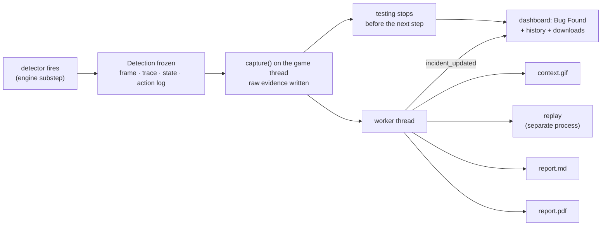

# Objective 3 — bug evidence, reports and incident management

When the QA agent's detector sees the game break a rule, the moment is frozen,
kept, explained and shown: an **incident** with the exact frame, the frames
before it, the per-frame trajectory, a Markdown and a PDF report, a replay
that says honestly whether it happens again — and the dashboard stops and
says **Testing Stopped - Bug Found**.



The game-level details are in the module docstrings; this page is the map
and the reasoning. The working log with the history of decisions is
[WORKLOG.md](WORKLOG.md).

---

## 1. Running it

```bash
python app.py                           # the dashboard on the CLEAN game
python app.py --game mario_bugged       # ... on the variant with the six deliberate bugs
python app.py --synthetic-probe 1000    # PIPELINE TEST: a labelled fake "bug" at world x 1000
python tools/incidents.py list          # the incident store from the command line
python tools/validate_incident_pipeline.py   # the end-to-end proof (~30 s, headless)
```

The dashboard plays the **approved Objective-2 brain**
(`glitch_hunter_main_brain.zip`), and only if its SHA-256 still
matches `FINAL_OBJECTIVE2.json`; otherwise it falls back to a working QA
brain, and every incident says which one it was.

## 2. The two game variants

| | `mario_clean/` | `mario_bugged/` |
|---|---|---|
| what | the canonical game every brain was trained and measured on | where deliberate bugs go |
| today | unchanged (git-moved from `mario_clone/`, history kept) | **six declared benchmark bugs** (2026-09-24), nothing else |
| protected by | `config.CLEAN_GAME_TREE_SHA256` (the tree hash of `mario_clone/` taken just before the rename) | every difference from clean is accounted for by a bug in `INJECTED_BUGS.json`: per file, per changed line block (`INJECTED BUG <id>` marker), and as a whole (pinned `diff_sha256`) |
| used by | training, tools, evaluator, dashboard default | only `--game mario_bugged`, and replays of its incidents |

A variant's identity is the SHA-256 of its **game tree** (`data/` + `resources/`,
text normalised to LF, bytecode ignored; `reporting/variants.py`). Both import
the game as the upstream package `data`, so a process hosts one variant at a
time; `custom_mario_env.claim_game_variant` refuses a second one rather than
silently running the wrong code. The dashboard's game switch first unloads the
loaded one completely (`release_game_variant`); a switched game plays byte for
byte like a freshly started one (`tests/test_game_variants.py`).

**The six bugs** (full declarations: `mario_bugged/INJECTED_BUGS.json`;
summary table: `mario_bugged/VARIANT.md`): 1 `stair-clip`, 2 `pipe-clip`,
3 `ceiling-clip`, 4 `invisible-wall`, 5 `false-goomba-hit`,
6 `open-sky-jump`. Each was placed from measurements of the approved brain
on the clean game (where its greedy route and 40 sampled episodes go), and
is proved against mario_clean by `tests/test_injected_bugs.py`: normal on
the clean game, defective on the bugged one, repeatable, and a control spot
per bug identical on both.

**Proof that nothing else differs** (`tests/test_game_variants.py`): the
changed files, changed line blocks and whole diff are all accounted for (see
the table); the level geometry differs only in the declared colliders; and
each variant, in its own process, plays the same 725-frame scripted run
identically - same NOOP frames (the pre-Objective-3 pin
`LEGACY_NOOP_600_SHA256`), same physics state and frames - until the two
first differ, which must happen inside a declared bug's zone (today frame
338, a jump taken inside the open-sky-jump zone).

**Changing a bug** (only when the owner specifies it): see
`mario_bugged/VARIANT.md`. `mario_clean/` must still match its pin.
Incidents from the bugged game name its tree hash and declared bugs.

## 3. Architecture

| Module | Role |
|---|---|
| `custom_mario_env.py` | the detector; with `enable_evidence()`, freezes a `Detection` at the trigger substep (off by default: training is untouched) |
| `reporting/events.py` | `Detection` (the boundary), `SyntheticProbe`, the closed detector registry |
| `reporting/collision_invariants.py` | the collision and jump-physics invariants (§4a), run by the env while evidence is on |
| `reporting/level_design.py` + `level1_design.json` | the level's designed static solids, taken from mario_clean and checked against it and against the drawn background |
| `reporting/pipeline.py` | `SessionRecorder` (caller-side context), `IncidentPipeline` (capture + worker) |
| `reporting/evidence.py` | Detection + context → raw evidence files and the canonical record |
| `reporting/schema.py` | the canonical incident schema, ids, validation, deterministic JSON |
| `reporting/store.py` | on-disk layout, atomic/immutable writes, path validation, recovery |
| `reporting/analysis.py` | severity, detector confidence, duplicate fingerprint and matching |
| `reporting/render.py` | GIF, Markdown, PDF - all derived from the record |
| `reporting/reproduce.py` | replay in a separate headless process |
| `reporting/provenance.py` | brain / game / code / runtime identity |
| `reporting/variants.py` | variant registry, tree hashes, declared-bug check |
| `dashboard_backend.py` | enables evidence, drains detections each step, hands them to the pipeline |
| `dashboard_service.py` | stops on a new incident; `bug_found` until the user resumes or resets |
| `app.py` | `/api/status`, `/api/incidents[/<id>]`, `/incidents/<id>/<file>`, `/incidents/<id>/bundle.zip` |

## 4. Event lifecycle

1. **Detect** — `CustomMarioEnv._detect_glitches` runs after every engine
   frame: the five engine invariants as before (below_world, above_world,
   speed, score_drop, coin_drop; each once per episode; semantics unchanged,
   with one audited correction, §12), and, while evidence is on, the
   collision and jump-physics invariants (§4a).
2. **Freeze** — on the first report of a kind in an episode, still inside
   that substep: the full-resolution frame is copied off the display surface,
   and a `Detection` takes copies of the info dict, Mario's extra fields
   (y_vel, state, form), the per-frame trace (ending AT the trigger), the
   visible geometry, the episode's per-frame action log and clock top-ups,
   and the engine settings a replay must reproduce.
3. **Drain** — after the 4-substep agent step, the backend drains the env's
   detections and, for each, calls `IncidentPipeline.capture()` with a
   `CaptureContext` (session/episode/step counters, recent agent actions,
   the stream frames of the **previous** steps only - the current step's frame
   was drawn after the trigger).
4. **Capture** (game thread, synchronous, ~110 ms): classify → fingerprint →
   duplicate? (append an occurrence, done) → claim an id → write
   `trigger.png`, `trajectory.json`, `context_frames.zip`, then
   `incident.json` last, then the manifest. When `capture()` returns "new",
   the incident is on disk.
5. **Stop** — the service sees the "new" outcome in the step's item and
   pauses before stepping again (`pause_reason = bug_found`), emits
   `testing_paused` and `bug_found`.
6. **Render** (worker thread): `context.gif` → replay → `report.md` →
   `report.pdf`, each retried up to 3 times; then the bundle is finalized
   (manifest read-only) and `incident_updated` is emitted.
7. **Review** — the dashboard shows the banner, the incident card and the
   history; files open in the browser or download.
8. **Resume** — only Start does it (it clears `bug_found`); the same session
   and episode continue. Reset ends the session and clears it; the incident
   stays.

## 4a. Collision and jump-physics invariants

Generic rules about what the engine does to Mario (`reporting/collision_invariants.py`).
None names a place: each is checked everywhere, against what is DRAWN - the
level's designed ground, pipes and steps (`reporting/level1_design.json`,
extracted from the pinned mario_clean and proved on every test run to be
its geometry and to be drawn, zero sky pixels inside) and the live bricks,
? boxes and enemies (sprites, drawn at their rects). The running game's
colliders are never the reference - a wrong collider cannot be its own alibi.

| Rule | Fires when | Kinds |
|---|---|---|
| solid penetration | Mario's collider is more than `PENETRATION_TOL` (6 px, the reachability model's own tolerance) inside a drawn solid on both axes; the engine resolves every contact flush, so a correct build shows 0 | `clip_into_step`, `clip_into_pipe`, `clip_into_ground`, `clip_into_block` (entered from below = a ceiling clip) |
| collision with nothing | the engine's collision response acts (a side stop with a collider flush on that side, standing on a collider, a head bump under one) and the collider it acted with is not on anything drawn | `invisible_collision` |
| hit without contact | Mario dies to an enemy, or shrinks, while no enemy or shell came within 2 px of him at any point of that frame (swept boxes) | `hit_without_contact` |
| impossible jump | he rises faster than the engine's fastest declared jump (12.5 px/frame; ordinary take-offs are 10-10.5, stomp bounces 7), or climbs higher above where he last stood than that speed can carry him (258 px) | `impossible_jump` |

Suspended exactly where the engine suspends collision (dead, flagpole,
castle walk, grow/shrink transitions). Read-only; +0.16 ms per frame, and
only while evidence is on, so training and evaluation are unchanged.
`above_world` is untouched and still fires on the open-sky jump too.

**Validation** (`docs/objective3/WORKLOG.md`): 101 clean-game episodes
of the approved brain (greedy + 100 sampled) - zero reports; clean play's
own jump envelope is 10.5 px/frame and 183 px, inside the limits. On
mario_bugged every injected bug is caught by its own rule on the dashboard
route, reproduced and fully reported; in 40 sampled episodes it was caught
every time it went deeper than the tolerance (the only misses were 1-6 px
grazes), and never without the bug happening.

## 5. The canonical record

`incident.json` (schema `glitch-hunter.incident/1`) - immutable facts:

| Section | Holds |
|---|---|
| `incident_id`, `created_utc`, `synthetic` | identity; capture time (UTC); synthetic flag |
| `summary` | category, title, the detector's sentence |
| `detector` | id, kind, message, **measured metrics** (the values that tripped it and the limit), semantics |
| `classification` | severity + rationale; detector confidence (level, basis, margin, reasons, downgrades) |
| `fingerprint` | duplicate signature (game tree + detector + kind + synthetic), site, radius |
| `location` | world collider, its centre, screen position in the 800x600 frame, camera x |
| `timing` | session id, episode index, engine frame in the episode, agent step (episode and session), frame 1-4 within the step, engine time (exact) |
| `gameplay` | agent action of the step, the frame's own action, Mario's extra state, the full info dict |
| `geometry` | every collider/sprite visible in the frame (group, rect, name/state) |
| `provenance` | brain (path, SHA-256, steps, approved?), game (variant, tree SHA-256, clean?, declared bugs), git commit (+ uncommitted changes?), runtime versions, reward mode |
| `evidence` | each raw file with SHA-256 and size; the trigger frame's pixel hash and size |
| `reproduction_inputs` | replayable?, game variant, engine timer, castle-door end, clock holding, extra detectors |
| `consistency` | whether the engine and the caller agree on episode and agent step, with notes |

`manifest.json` (mutable until finalized) - SHA-256 of every file, the status
of each render (`pending/done/failed/skipped`, attempts, last error), the
reproduction status, and a history of every change.
`trajectory.json` - the per-frame trace (up to 244 frames) and the complete
per-frame action log from the reset (base64 + SHA-256).
`reproduction.json` - the replay's verdict and comparison details.
`occurrences.jsonl` (store level, append-only) - later sightings.
`capture_failures.jsonl` (store level) - detections whose bundle could not be written.

`tools/incidents.py verify` re-hashes everything and re-validates the record.

## 6. Evidence capture - and why at that moment

The agent acts once per 4 engine frames, and the wrapper keeps only the last
frame's info. The dashboard's stream frame is rendered after all four. So a
screenshot taken where the dashboard sees the step would be **0-3 frames
late**. The trigger frame is instead copied inside the substep that fired,
after that frame's update and draw - the same state the detector read.
`tests/test_incident_capture.py` pins it: the frame equals the one drawn on
the trigger substep and differs from the frames before and after, and from
the stream frame whenever the trigger is not the step's last substep.

**Observation invariance.** Evidence is off unless enabled. When on, it only
reads the engine; `test_evidence_changes_neither_observations_nor_info`
plays the same script with it off and on and compares every observation,
info dict, reward and episode end. The GIF context costs the game loop
nothing: it reuses the JPEG frames the dashboard already streams.

## 7. Storage

```
incidents/                              (git-ignored; override with --incidents-dir)
  INC-20260923-153503-884d84/           one self-contained bundle
    incident.json  trigger.png  context_frames.zip  trajectory.json   raw, read-only
    context.gif  report.md  report.pdf  reproduction.json              derived, read-only
    manifest.json                                                      read-only once finalized
  occurrences.jsonl  capture_failures.jsonl
  _incomplete/                          captures a crash interrupted (kept, not deleted)
  _validation/                          tools/validate_incident_pipeline.py runs
```

Ids are `INC-<UTC date>-<UTC time>-<6 random hex>`, claimed with an exclusive
`mkdir`, so two captures - even in two processes - cannot share a bundle.
Every write is temp + fsync + rename (with a short retry for Windows file
holds). Nothing is ever overwritten: a re-render is `report.v2.pdf`, recorded
in the manifest history with its reason (`tools/incidents.py rerender`).

## 8. Reports

Both reports come from one set of builders (`render.py`), so they cannot
disagree. Sections: overview (identity, severity, confidence, reproduction,
occurrences, time, place, game, brain), **what was observed (measured)**,
**interpretation (inferred, not measured)** - which always ends "Root cause:
unknown" - where (screen position, visible and nearest geometry), what led up
to it (the last 24 frames, the recent actions), evidence (images, every file
with its hash and any failed render), reproduction, provenance, consistency
checks, limitations. A synthetic incident opens with a red "SYNTHETIC TEST
EVENT - NOT A GAME BUG" notice and carries no interpretation of the game.

The PDF is a real document (fpdf2): tables, the full trigger frame, a
filmstrip of 4 context frames plus the trigger, the trace table, evidence
hashes, page numbers. The GIF plays the context at real game speed (each
frame 4 engine frames apart), then holds the red-framed trigger for 1.5 s.

## 9. Dashboard

* **Bug Found banner** over the video: shown from the server's `bug_found`
  (the `bug_found` event, and `/api/status` on every (re)connect), with the
  incident's type, id, time, place, severity, confidence, reproduction,
  occurrences and links. It is never a frontend-only guess.
* **BUG TRACKER** = this session's incidents from `/api/incidents` (since the
  dashboard started or was last reset: Reset empties it, like the log),
  newest first; `/api/incidents?all=1` and `tools/incidents.py list` give
  the whole history, which is never deleted. Each incident with its facts
  and links (PDF, Markdown,
  trigger frame, GIF, whole bundle as .zip). Reports still rendering show as
  such, and fill in when `incident_updated` arrives.
* **Select Game Environment** switches between Mario Game (Cleaned) and
  Mario Game (Bugged): it resets the dashboard and the game thread unloads one
  variant completely before loading the other (`switch_game`); a yellow badge
  marks synthetic-probe mode.
* Files open inline (`?download=1` saves them). Requests are validated against
  the store (SECURITY.md); everything else is a 404.

## 10. Duplicates

A sighting is the SAME incident only if it has the same game tree, detector,
kind and synthetic flag **and** its trigger collider is within
`DEDUP_RADIUS` (54 x 91 px) of the incident's: one largest collider (big
Mario, 40 x 80) plus one frame of the largest motion (14 px horizontally, the
13.2 px normal-play envelope rounded up; 11 px vertically, the engine's
terminal fall speed) - they would overlap if caught one frame apart.
Otherwise it is a new incident, even for the same kind: two real bugs can
share a category. A sighting with no position is never merged. Duplicates
append to `occurrences.jsonl` and raise the count - no second incident -
and, like every detection, stop testing until Start Testing (the owner's
rule, 2026-09-24). The engine's own once-per-episode latch stops a
persistent fault from firing every frame. Known fingerprints are reloaded at start-up, so a sighting
after a restart is still recognised.

## 11. Severity, confidence, reproduction - kept apart

* **Severity** = impact if real, fixed per kind with its reason: below_world,
  hit_without_contact high; above_world, speed, the clip_into_* kinds,
  invisible_collision, impossible_jump medium; score_drop, coin_drop low;
  synthetic none.
  Nothing is "critical" today (reserved for a crash or corruption, which no
  detector reports).
* **Detector confidence** = does the evidence support a genuine engine state?
  Invariant checks (exact before/after values) start high; threshold checks
  are high only if the reading passed the threshold by at least the whole gap
  between normal play and the threshold, else medium. Lowered one level each
  for: Mario dead, end-of-level sequence, the first 2 frames after a reset.
  A frame the engine could not read is low outright. Synthetic:
  not_applicable.
* **Reproduction** = what a replay found (§13). Never folded into the other two.

## 12. Hard-audit findings (fixed)

| Finding | Evidence | Fix |
|---|---|---|
| The dashboard's frame is up to 3 frames after the trigger | the frame is drawn after the 4-substep step | capture inside the trigger substep (§6), pinned by tests |
| **Detector false positive on unreadable frames**: the engine fallback's placeholder zeros were compared with the last real score/coins | reproduced: "Coin total went backwards (3 -> 0)" on a frame where nothing was measured | skip score/coin checks on such frames and keep the last real baseline; the alert feeds only the dashboard, never the reward |
| Incident ids accepted non-ASCII digits and a trailing newline (`\d`, `$`) | both matched before the fix | ASCII classes + `fullmatch` everywhere |
| Replacing `manifest.json` fails on Windows while a browser downloads it | Windows cannot rename over an open file | bounded rename retry in the store |
| A capture that fails outright would leave no trace | e.g. a full disk | `capture_failures.jsonl` keeps the detector's facts; the dashboard stops and says so |
| A bundle interrupted mid-capture could look like an incident | crash between files | `incident.json` written last; `_incomplete/` on recovery |
| A context frame from after the trigger could enter the GIF | the step's own stream frame | frames pushed only after capture; tested |
| Read-only maintenance commands could move files (recovery) | `tools/incidents.py list` | `recover=False` for list/show/verify; tested by snapshot |

## 13. Reproduction

The engine is deterministic (game time is a frame counter; nothing draws
random numbers), so an episode is a function of its per-frame actions and QA
clock top-ups - which the incident records from the reset. A separate headless
process (`python -m reporting.reproduce`) rebuilds the same game variant with
the same engine settings and detectors, replays every frame, and compares
the recorded trace frame by frame, the clock top-ups, whether the SAME
detector fires on the SAME frame, and the trigger pixels.

| Status | Meaning |
|---|---|
| reproduced | same state throughout, same detector on the same frame, identical pixels |
| reproduced_state_only | as above, but the pixels differ |
| not_reproduced | identical state, but the detector stayed quiet |
| diverged | the state separated from the recording before the trigger (first frame and field recorded) |
| not_possible | no action log from the reset, a tampered log, a changed game, an unknown detector |
| timeout / error | the replay process did not finish / failed |

Measured replay cost: 1.48 ms per frame, ~0.65 s start-up. Verified both
ways: a real incident reproduces exactly (also from a real game window,
replayed headless), and a tampered log, an edited trace, a changed game tree,
a quiet detector, different pixels and an anomaly injected into engine
memory (not in the action log) each get the honest status instead.

## 14. Failures never lose the incident

Raw evidence is written before anything else happens. Every derived artifact
is rendered off the game thread, retried (3 attempts, 0.5 s / 2 s apart), and
its failure recorded in the manifest and shown in the dashboard; the other
artifacts still render. A file written by a run that died before recording
it is adopted, not re-rendered. On start-up, recovery moves interrupted
captures to `_incomplete/`, removes torn temp files, rebuilds a missing
manifest and finishes unfinished renders. Errors in reporting are logged and
recorded - they can never create an incident.

## 15. Objective 2 stays protected

The dashboard reads the frozen brain and coverage and writes neither;
reporting writes only under its store. `tests/test_objective2_protection.py`
runs a complete incident cycle (capture, GIF, reports, replay subprocess) and
then compares the size and modification time of every file in the project:
nothing changes. The frozen pair is re-hashed against its closure record and
must still be read-only. The end-to-end tool re-hashes every protected file
before and after its run.

## 16. Tests and validation

| File | Proves |
|---|---|
| `test_game_variants.py` | clean pin, every difference accounted for (file, marked line, pinned diff), per-process isolation, identical behaviour outside the declared bugs |
| `test_injected_bugs.py` | each bug normal on clean, defective on bugged, repeatable, caught by its own detector; controls silent |
| `test_collision_invariants.py` | each rule, its limits, the clean-game false positives found while building it (regressions), the design file |
| `test_bug_incidents.py` | (slow) one dashboard episode per game: every bug a reproduced, reported incident; the clean game reports nothing |
| `test_incident_capture.py` | exact trigger frame, observation invariance, trace/action log bounds and episode boundaries, detector semantics, clock top-ups |
| `test_incident_pipeline.py` | schema, immutability, unique ids, duplicates, severity/confidence, rendering, failures, retries, recovery, path validation, audit fixes |
| `test_incident_reproduce.py` | honest reproduction statuses on real replays |
| `test_dashboard_incidents.py` | Bug Found state machine, resume/reset, backend context, routes and a dozen traversal attempts, brain selection |
| `test_objective2_protection.py` | nothing outside the store changes; the frozen pair still matches |
| `test_incident_tools.py` | the maintenance tool; the end-to-end validation (slow) |

`tools/validate_incident_pipeline.py` - 36 checks on the real stack, headless
and `--windowed`; see the worklog for the results of each run.

## 17. Limitations (stated, not hidden)

* The clean game has produced no incident. All six deliberate bugs in
  mario_bugged are caught with no probe by generic rules (§4a); a clip
  shallower than the 6 px tolerance is deliberately not reported.
* The static-solid reference is Level 1-1's design file; another level
  would need its own (tools/build_level_design.py).
* The dashboard plays greedily on a deterministic engine: every episode is
  the same route. On the bugged game that route meets all six bugs, in the
  order sky jump, pipe, invisible wall, ceiling, stair, false Goomba hit -
  and the last one kills Mario, so a greedy episode on the bugged game never
  finishes the level. Sampled play meets them at the rates in
  `docs/objective3/WORKLOG.md`.
* The window, when paused, can show a frame up to 3 frames after the
  trigger; the incident holds the exact one.
* Context frames are JPEG stream frames at 480x360, one per agent step; only
  the trigger frame is full resolution and lossless.
* The wall-clock time is the capture instant (within one agent step of the
  trigger); the engine time is exact.
* Reproduction replays the engine inputs, not the policy: it says whether
  the moment recurs given the same inputs, not how often the agent gets there.
* Duplicate matching is in-process per dashboard; two dashboards sharing one
  store at once would each create their own incident for the same site.
* Crashes of the game itself (an exception in `env.step`) are not incidents:
  no detector can tell a game crash from a harness bug yet.
* The five detectors are the Objective-2 ones; new bug classes will need new
  detectors (added through `ExtraDetector`, whose specs a replay can rebuild).
* Evidence files are read-only on disk; deleting a bundle by hand needs the
  read-only attribute cleared first.
